% China internet status quo
% Tyr Chen
% Sep 1st, 2016

# Is it still copycat?

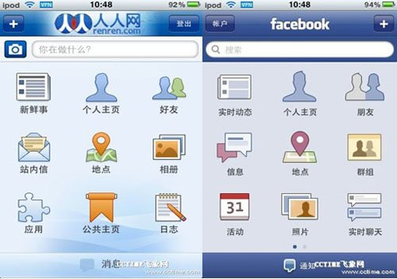

# wechat

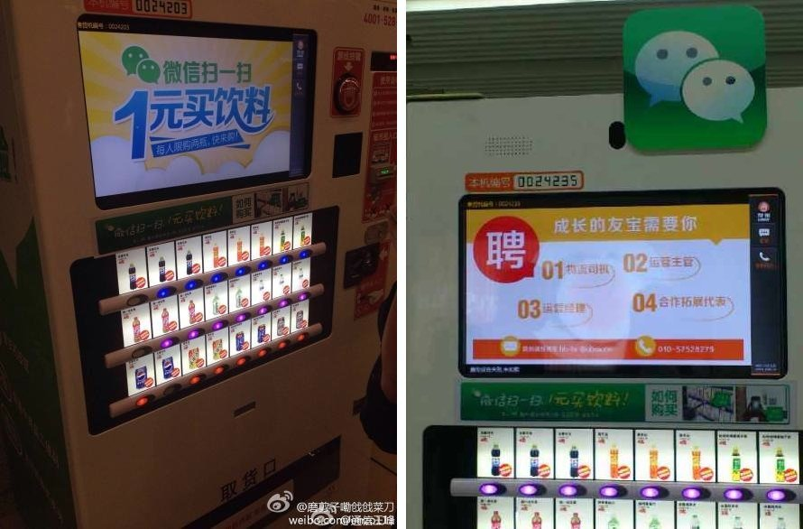

----

----

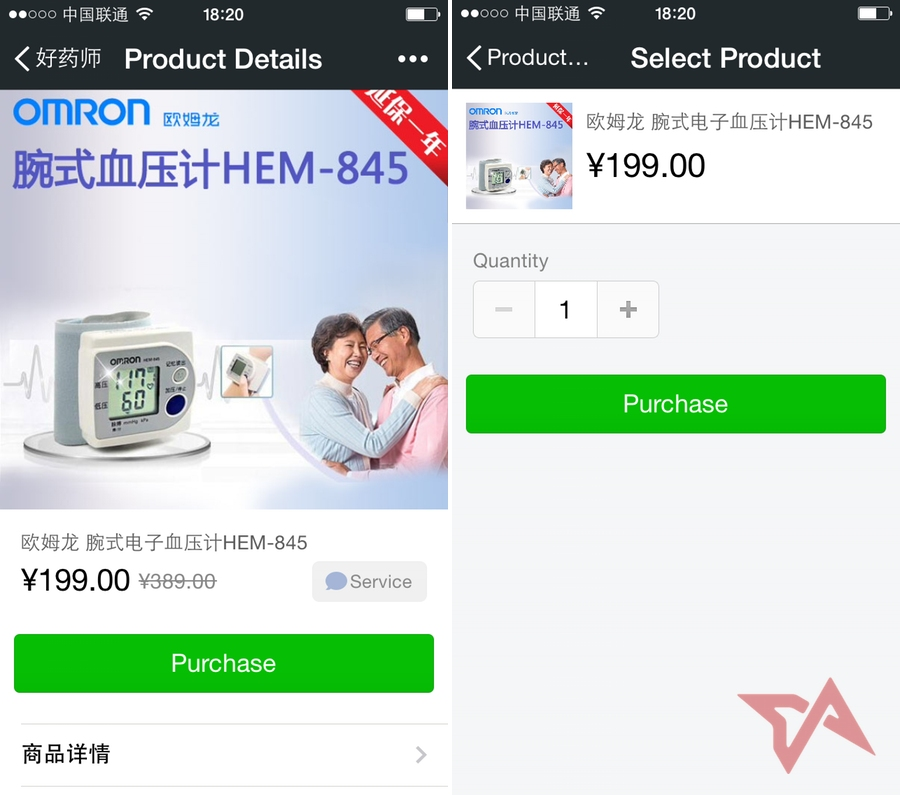

----

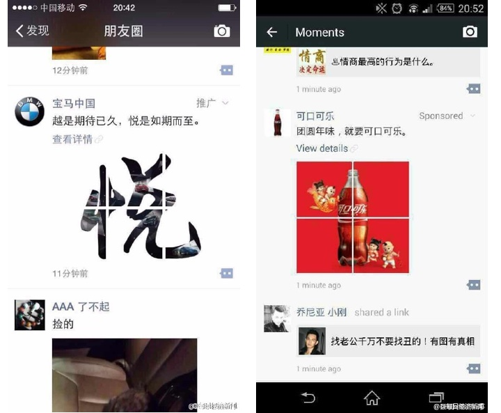

----

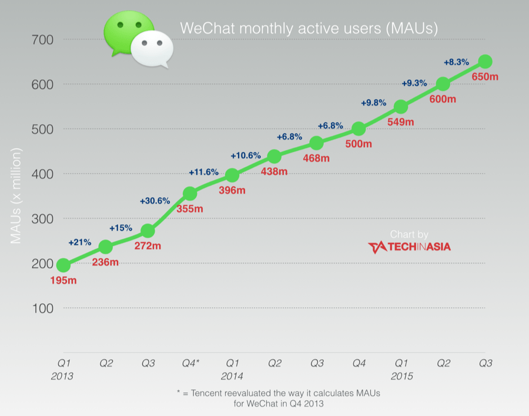

# Mobile payment

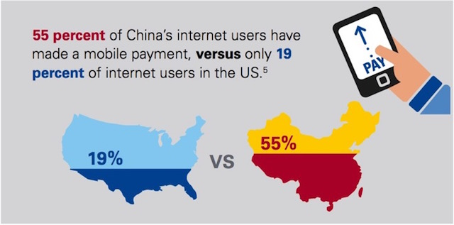

# Mobile payment market

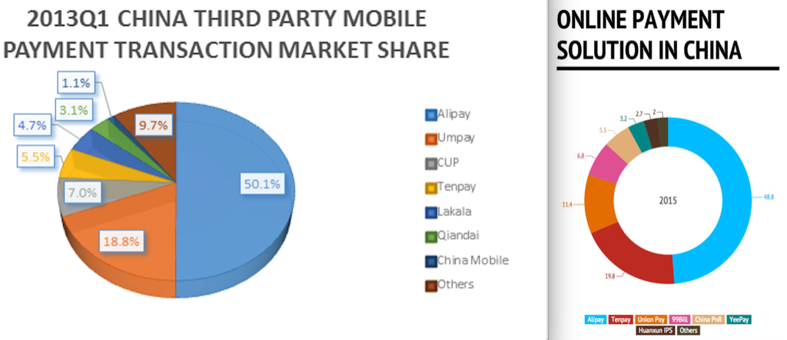

# O2O

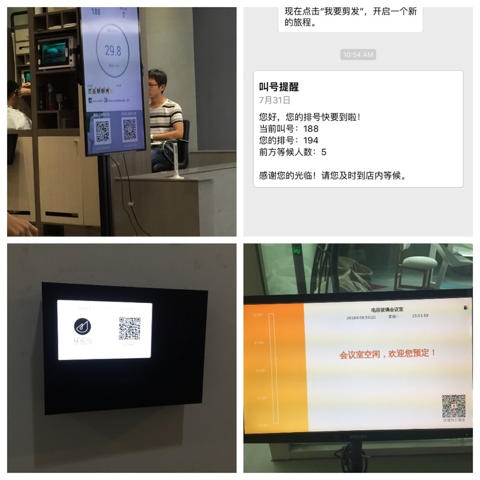

# Didi VS uber

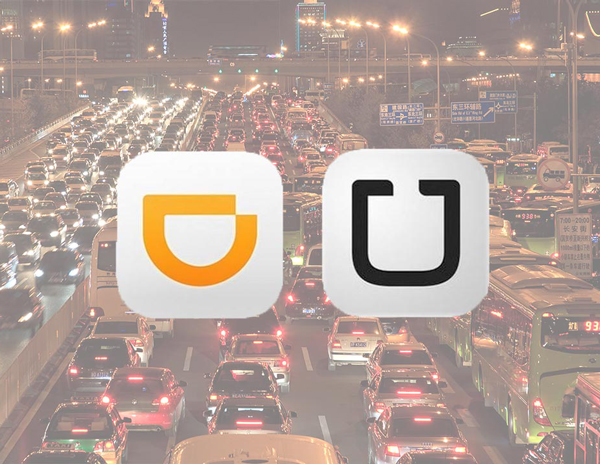

(Didi & Uber China merged, new Didi is 35B market value, uber owns 20%)

# What causes US companies failing in Chinese market?

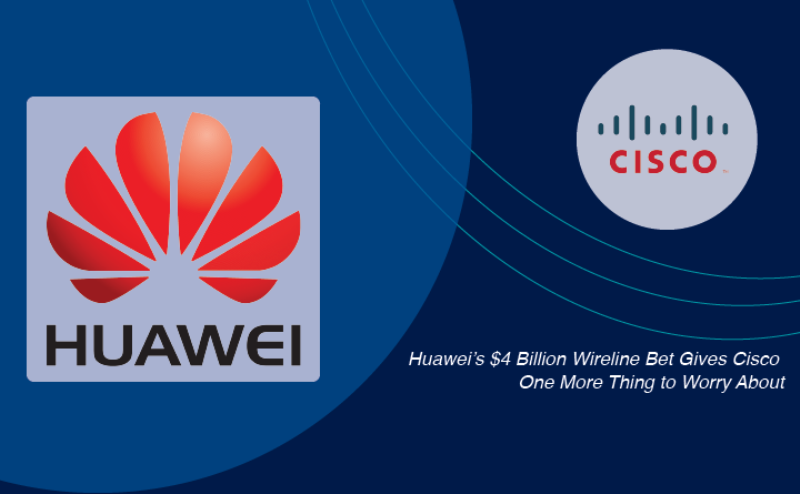

----

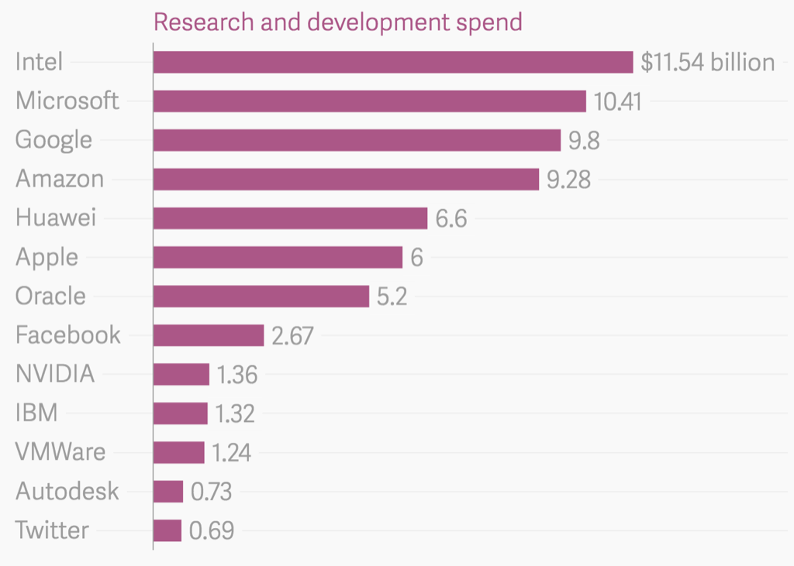

that's 2014, 9B USD (CNY59,607 million) in 2015

# Q&A
