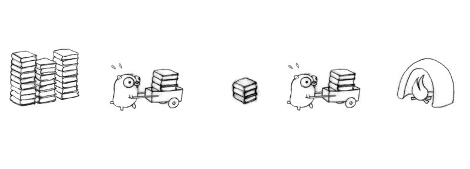

% Concurrency
% Tyr Chen
% Jan 7th, 2015

----


# The Future of Computing

* more cores in a DIE
* more DIEs in a server
* more servers for a system
* systems are getting more complicated

# Concurrency vs. parallelism

* Concurrency is about dealing with lots of things at once
* Parallelism is about doing lots of things at once
* One is about structure, one is about execution
* Structuring your solution in a concurrent way to get parallelism for free

# A little bit about CPU parallelism

* Bit level (32bit vs 64bit)
* Instruction execution level (pipeline, out of order)
* Instruction data level (SIMD)
* Task level (multi-core, multi-processes)

----


----

[](http://taco.cse.tamu.edu/utsa-www/cs5513-fall07/lecture5.html)

----

The thoughts backed hardware parallelism can be applied to software too

----

The folowing gopher figures are from Rob Pike's famous talk: [Concurrency is not 
Parallelism](https://www.youtube.com/watch?v=cN_DpYBzKso), [slides](http://concur.rspace.googlecode.com/hg/talk/concur.html)

# Simplest system structure


# More concurrency


they're racing...

# Solver for racing


Possibly make things simpler, but mostly not...

# Another solution


divide and conquer - each gopher's job is much simplified (but requires proper communication)

# Keep evolving


# Yet another solution



coordinate by queues

# Put all together


# Concurrency Models

* Lock based concurrency
* CSP
* Actor
* STM (Software Transactional Memory)
* Future (Promise, Observable, etc.)


# Lock based concurrency

----

it is supported almost by every language, and every one who write multithread code knows about locks / semophore / mutex

# Problem

* Taking too few locks
* Taking the wrong locks
* Taking locks in the wrong order
* Error recovery
* Hard to compose

----

# CSP

# Key concepts

* Sequential __processes__
* Synchronous communication through __channels__
* Multiplexing of channels with __alternation__

# Example code

```go
package main

import "fmt"

func sum(a []int, c chan int) {
    sum := 0
    for _, v := range a {
        sum += v
    }
    c <- sum // send sum to c
}

func main() {
    a := []int{7, 2, 8, -9, 4, 0}

    c := make(chan int)
    go sum(a[:len(a)/2], c)
    go sum(a[len(a)/2:], c)
    x, y := <-c, <-c // receive from c

    fmt.Println(x, y, x+y)
}
```

----

> Do not communicate by sharing memory; instead, share memory by communicating.
> 
> -- Effective Go


# CSP Communication


# More on CSP

* unbuffered / buffered channel
* requires rendezvous between the processes involved in sending and receiving the message (aka synchronous communcation)
* language support: occam, go, clojure (core.async)

snapshots are from [csp-presentation](http://arild.github.io/csp-presentation)

# Actor Model

# What is actor?

* lightweight object called __process__
* no shared data
* message are kept in mailbox and processed in order

----


# CSP vs actor


# Example code

```elixir
defmodule KV do
  def start_link do
    Task.start_link(fn -> loop(%{}) end)
  end

  defp loop(map) do
    receive do
      {:get, key, caller} ->
        send caller, Map.get(map, key)
        loop(map)
      {:put, key, value} ->
        loop(Map.put(map, key, value))
    end
  end
end

iex> send pid, {:put, :hello, :world}
#PID<0.62.0>
iex> send pid, {:get, :hello, self()}
{:get, :hello, #PID<0.41.0>}
iex> flush
:world
```


# More on actor

* message sending is asynchronous
* Performance is bad when sending big data (VM will do some compromise, e.g. [refc binaries](http://www.erlang.org/doc/efficiency_guide/binaryhandling.html#refc_binary))
* language support: erlang, elixir (use erlang VM as well), scala (akka)

----


# More on erlang concurrency

* Let it crash
* Supervision tree

Joe Armstrong: [Erlang software for a concurrent world](http://www.infoq.com/presentations/erlang-software-for-a-concurrent-world)

----


# STM

----

similar to database transaction


# Example code

```clojure
(def account (ref 0))

(defn deposit [amount]
  (alter account + amount ))

(def f (future (dosync (deposit 5))))

(do 
  (deref f)
  (println @account))


```

# More on STM

* ACID without D
* Implementation based upon MVCC (multi-version concurrency control)
* Transaction operate under snpashot isolation
* Optimistic, assumes low chances of write collisions
    - if collision happened, retry is a big waste of resources
* No deadlocks, livelocks or race conditions possible
* No good tool to inspect the retry (so to optimize)


# Future (Promise, Observable, etc.)

# What is future?

An object that hold data which is not resolved immediately.

----

# What is promise?

represents a proxy for a value not necessarily known when the promise is created.

* pending: initial state, not fulfilled or rejected.
* fulfilled: meaning that the operation completed successfully.
* rejected: meaning that the operation failed.

----


# Promise example

```javascript
function extractZip(filename) {
  return new Promise((res, rej) => {
    const zip = new AdmZip(filename);
    const entries = zip.getEntries();
    const files = entries
      .map(entry => {
        return entry.entryName;
      })
      .filter(name => /access.log\-[0-9]+.gz|access.log/.test(name))
      .map(name => {
        const target = ['./logs/', filename].join('');
        // side effect
        if (!DEBUG) zip.extractEntryTo(name, target, false);
        return target.concat('/', path.basename(name));
      });

    res(files);
  })
}
```

# More about promise

* A single value
* Once fired, cannot be stopped (either fulfilled or rejected)


# What is Observable?

datatypes that represent a value 'over time'


----


----


# How to create

```javascript
const extractLogObservable = function(filename) {
  return Rx.Observable.create(observer => {
    const reader = readline.createInterface({
      input: fs.createReadStream(filename)
    });
    reader.on('line', line => {
      observer.onNext(line);
    }).on('close', () => {
      totalFiles--;
      console.log('finished reading %s, unclosed file %d', filename, totalFiles);
      observer.onCompleted();
    });

    return function() {
      reader.close();
    }
  });
}
```

# [Typeahead](https://s3-us-west-2.amazonaws.com/eng-assets/slides/reveal/assets/code/index.html)

```javascript
var throttledInput$ = Rx.DOM.keyup($search)
  .pluck('target', 'value')
  .filter(text => text.length > 2)
  .debounce(500)
  .distinctUntilChanged();

function searchWiki(text) {
  const url = 'https://en.wikipedia.org/w/api.php?action=opensearch&format=json&search='
    + encodeURIComponent(text) + '&callback=JSONPCallback';
  return Rx.DOM.jsonpRequest(url).retry(3);
}

const suggestion$ = throttledInput$.flatMapLatest(searchWiki);

suggestion$.subscribe(
  data => {
    const results = data.response[1];
    clearSelector($results);
    results.forEach(appendChild);
  },
  e => {
    clearSelector($results);
    appendChild(`Error: ${e}`);
  }
)
```

# More on Observable

* Very rich API (see: [operators](http://reactivex.io/documentation/operators.html))
* composable, cancallable
* Not fired if no one subscribe to it (for cold observable)


# Q & A
