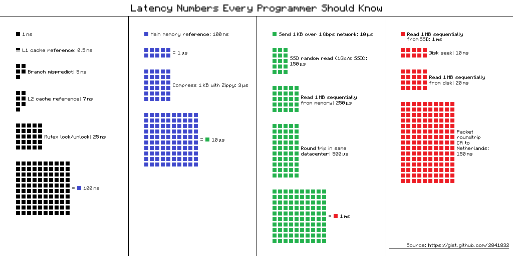

% Tools to store data
% Tyr Chen
% Jan 14th, 2015

----

# Why?

# Where?

* Memory
* File
* Database
* Queue

# Memory

* Native datastructure
    - list: ``[1, 2, 3, 4]``
    - map: ``{a: 1, b: 2}``
* advanced datastructure
    - bloom filter (membership check)
    - FIFO queue (task system)
    - rb tree (scheduler)
    - graph (friend relationship)
* Fast and isolated(unless you share)
* always limited (can only fit for hot data)

----

### bloom filter


----




# File

* Text file
    - configuration
    - AOF logs
* Binary file
* very easy to use, durable
* might not be good for distributed systems which nodes come and go

# Database

* relational
* NoSQL (key-value, document)
* read (or write) optimized storage libraries / systems for large data
* limited by CAP theorem

----


# Relational DB

* SQlite
* MySQL, postgresql, etc.
* [comparison between mysql & postgresql](https://www.wikivs.com/wiki/MySQL_vs_PostgreSQL)

----

### Postgresql

* better concurrency support, better performance (?)
* Direct JSON support (see: [postgrest](https://github.com/begriffs/postgrest))
* server-side scripting with map-reduce support
* [PostGIS](http://postgis.net/)
* [Full text search](https://blog.lateral.io/2015/05/full-text-search-in-milliseconds-with-postgresql/)
* Better [Tree](http://www.slideshare.net/quipo/trees-in-the-database-advanced-data-structures/22-Fixing_the_Adjacency_List_Model), and [Graph](http://www.slideshare.net/quipo/rdbms-in-the-social-networks-age) support

# Key-value DB

* levelDB / RocksDB / berkeleyDB / etc.
* DynamoDB / Riak
* CouchDB / PouchDB

# levelDB

fast key-value storage library written at Google that provides an ordered mapping from string keys to string values

* Benefit
    - Embedded to application
    - Just need library support
    - Provide durability
* Drawback
    - single threaded access (db level lock)
    - can not act as db server

----

```javascript
var levelup = require('levelup')

// 1) Create our database, supply location and options.
//    This will create or open the underlying LevelDB store.
var db = levelup('./mydb')

// 2) put a key & value
db.put('name', 'LevelUP', function (err) {
  if (err) return console.log('Ooops!', err) // some kind of I/O error

  // 3) fetch by key
  db.get('name', function (err, value) {
    if (err) return console.log('Ooops!', err) // likely the key was not found

    // ta da!
    console.log('name=' + value)
  })
})
```

# DynamoDB

Fully managed, distributed key-value database provided by amazon, based on [Dynamo paper](http://www.allthingsdistributed.com/files/amazon-dynamo-sosp2007.pdf).

* Benefit
    - (almost) constant read/write speed at whatever amount of data
    - highly scalable, highly available
* Drawback
    - really hard to use (at first time)
    - hard to pick up a right hash key / range key
    - eventually consistency (you can [consistent read](http://stackoverflow.com/questions/20870041/amazon-dynamodb-strong-consistent-reads-are-they-latest-and-how))
    - the more capacity you provision, the more you pay

----

### Consistent hashing


From: [distributed algorithms in nosql](https://highlyscalable.wordpress.com/2012/09/18/distributed-algorithms-in-nosql-databases/)

----


----

### DynamoDB example

```javascript
function queryExpires(expires) {
  var params = {
    TableName: TABLE,
    IndexName: EXPIRES_INDEX,
    KeyConditionExpression: '#type = :v_type AND #expires < :v_expires',
    ExpressionAttributeNames: {'#type': 'type', '#expires': 'expires'},
    ExpressionAttributeValues: {
      ':v_type': {'S': 'connect-session'},
      ':v_expires': {'N': expires.toString()}
    },
    ProjectionExpression: 'id'
  }
  return new Promise(function(res, rej) {
    db.query(params, function(err, data) {
      if (err) {
        rej(err);
      } else {
        res(data);
      }
    });
  });
}
```

# Document DB

* MongoDB
* ElasticSearch

# MongoDB

* Benefit
    - Self contained, de-normalized document (very fast query)
    - Super rich query / sort / aggregate functionalities
* Drawbacks
    - Use crappy mmap / fsync() for < 3.0
    - Still young and unsteady (especially auto sharding)
    - By default it's CP!
    - easy to be misused
        * too many indexes v.s. too little indexes
        * try to use autoincrement id
        * try to join among different collections

----

### Why mongodb is CP?

* Sharding level: one authoritative shard per data segment (C), shards work independently (P), if a shard is not available its data isn't available (A)

* Replica set level: one authoritative master node (C)

See: [High Availability In MongoDB](http://stackoverflow.com/questions/16248656/high-availability-in-mongodb)

# ElasticSearch

Built on top of apache lucence, provide an easy to use interface to build search index.

* Benefit
    - Very powerful to query both structured / unstructured data
    - Scalable and very easy to use
* Drawbacks
    - not suitable for main data store

----

### ElasticSeach example

```javascript
client.search({
  index: 'twitter',
  type: 'tweets',
  body: {
    query: {
      match: {
        body: 'elasticsearch'
      }
    }
  }
}).then(function (resp) {
    var hits = resp.hits.hits;
}, function (err) {
    console.trace(err.message);
});
```


# Queue

* ZeroMQ / nano
* SQS
* RabbitMQ / ActiveMQ / etc.

(might give in a separated session)

# What?

* Binary
* JSON
* XML
* MsgPack/protoBuf/avro/Thrift
* SQL/Mongo document/Redis command

[Performance benchmark](https://github.com/thekvs/cpp-serializers)

----

### msgpack examples

```javascript
var assert = require('assert');
var msgpack = require('msgpack');

var o = {"a" : 1, "b" : 2, "c" : [1, 2, 3]};
var b = msgpack.pack(o);
var oo = msgpack.unpack(b);

assert.deepEqual(oo, o);
```

# How?

* Serialize
* Deserialize


# Q&A
