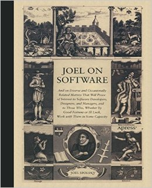
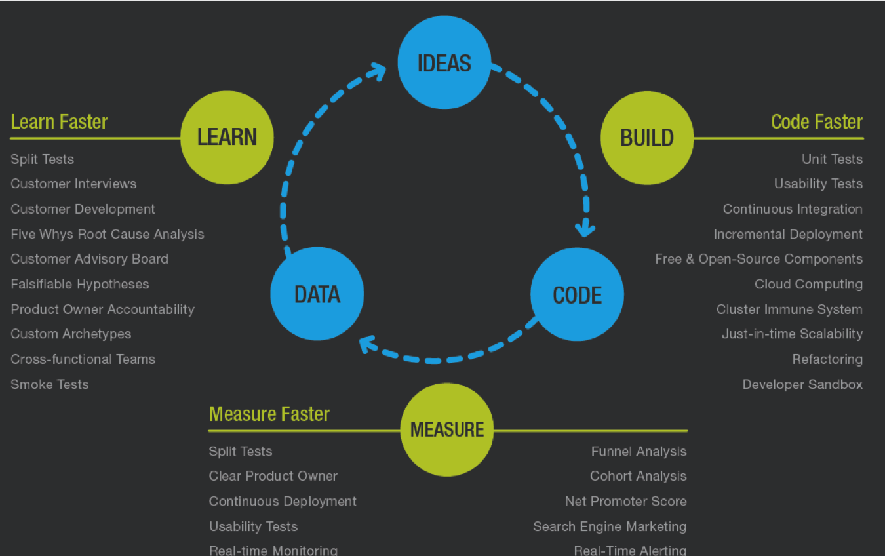
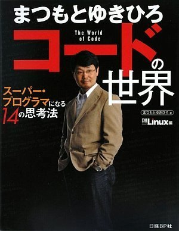
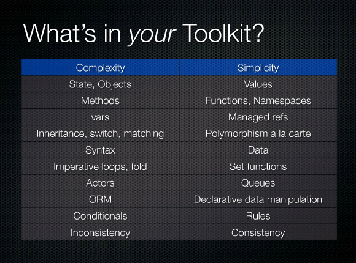
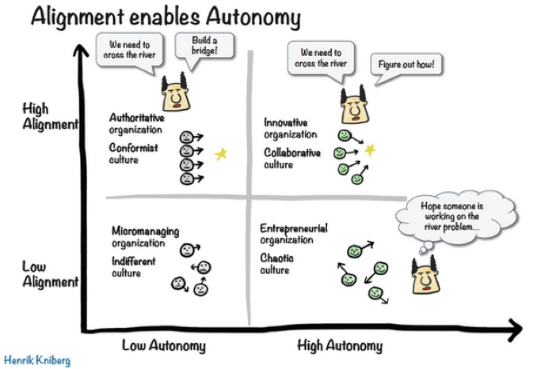

% Eng all hands
% Tyr Chen
% Aug 31th, 2016

# A story

Schlemiel the Painter's Algorithm




# My engineering principles

* Build - Measure - Learn
* DRY (Don't repeat yourself)
* Open-closed Principle
* More descriptive code, less imperative
* Make small contributions
* Use/Build tools wisely
* Proud to be the owner

----



* Fail early fail fast, and learn fast (experience)
* Deploy often

# DRY

* No ``copy & paste``, refactor when necessary
* No repeat manual steps, automate if possible




# Open-closed

* Software should open for extension, close for modification
* Separate data (rules) from code (thinking in lisp way)

Not good:

``` javascript
for (...) {
    if (...) {
        // do some stuff
    } else if (...) {
        // do other stuff
    } else if (...) {
        ...
    }
    ...
}
```

# Open-closed

Good:

``` javascript
var filterWithActions = [{ // extracted data from code
    filter: filterFN1, // filterFN / ActionFN is your lego blocks
    action: actionFN1
}, ...]
iterate(iterable, filterWithActions)
```

implementation of ``iterate()``:

``` javascript
iterable.map(item => {
    for (var entry of filterWithActions) {
        if (entry.filter(item)) {
            entry.action(item);
            break;
        }
    }
})
```

# Descriptive code

* more transformation, less mutation



[The original talk by Rich Hickey - highly recommend!](https://www.youtube.com/watch?v=rI8tNMsozo0)

# Make small changes

* Big task: divide and conquer
* Iterative improvement
* Commit and merge daily
* experiment when necessary
* measure the difference (and learn!)

# Use/Build tools wisely

* Tools matter!
* Find suitable tools first, then build our own
* Let information find you!

# Proud to be the owner

* Code/product is your own baby
* Is it really awesome?
    - definition of awesomeness
* Never let the "customer" down
* I don't know the answer __yet__
    - but I'll figure out
* Let others contribute if you're blocking their way
    - Open source model - owner is the gatekeeper

# Culture

----

> To manage yourself, use your head.
>
>
> To manage others, use your heart.

# Principles we value

* Trust over Control
* Commitment over Compliance
* Data over Authority
* Lead by Example

# Motivating & aligning effort



# Another story


[Believe is self-fulling prophecy](https://www.youtube.com/watch?v=IwUecXRvnS0)

# Talk is cheap, let's deliver!

# Q & A
