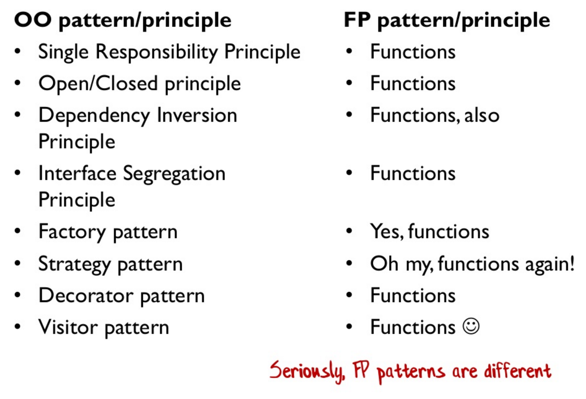
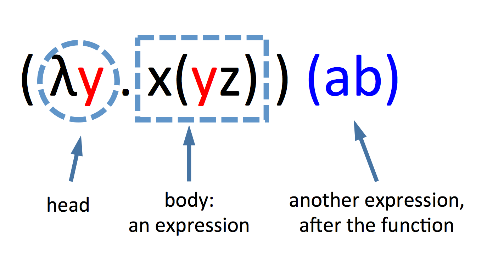
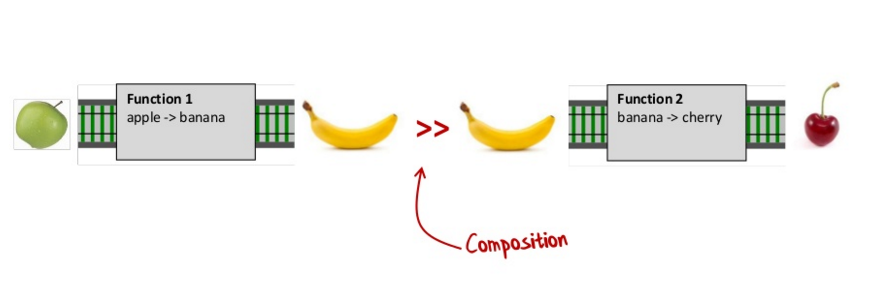
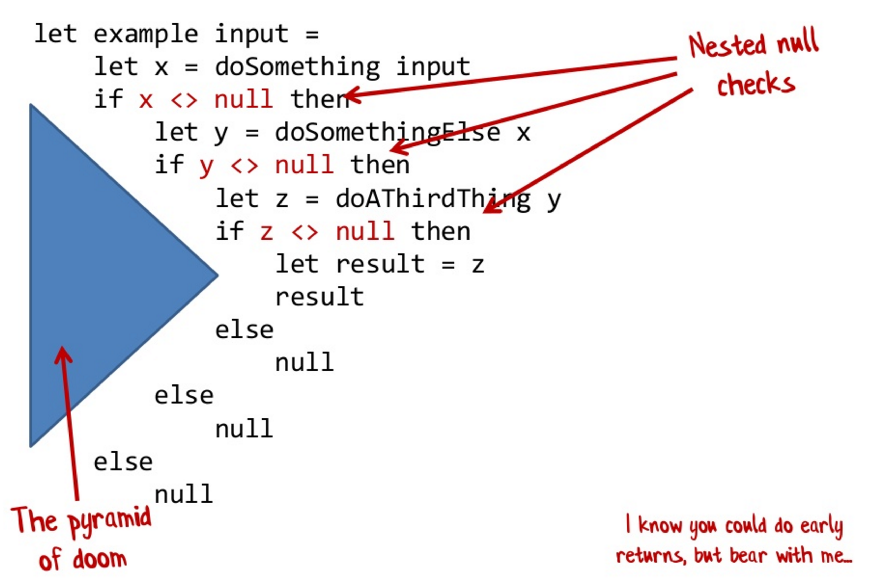
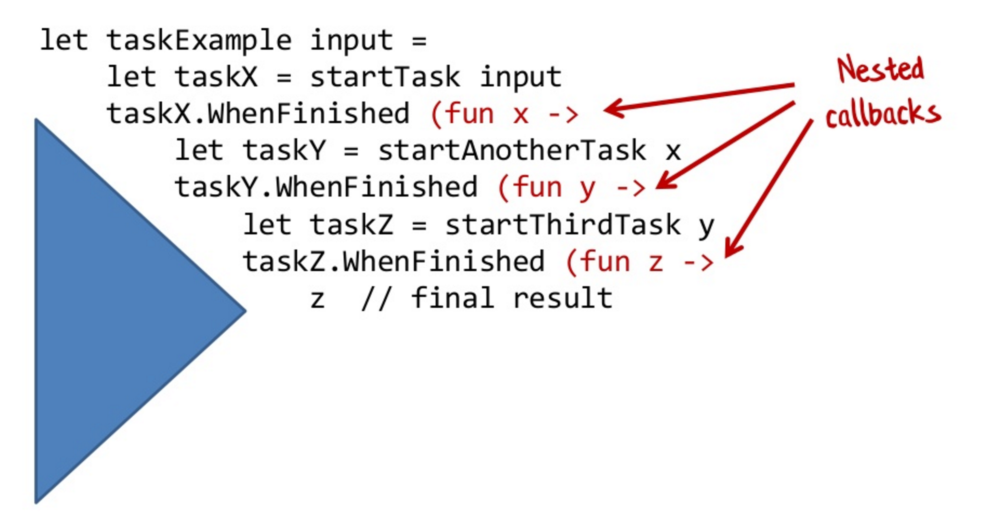
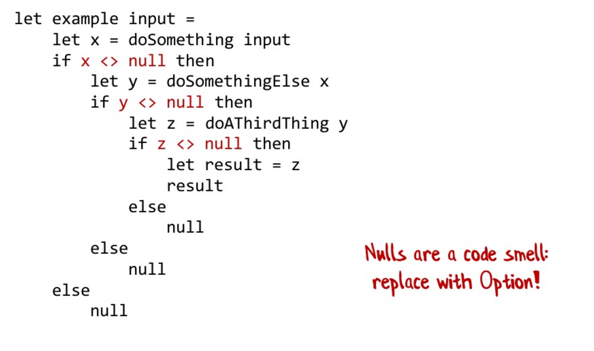
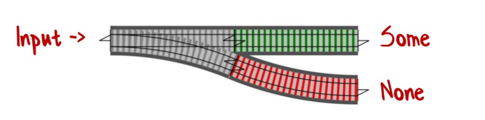
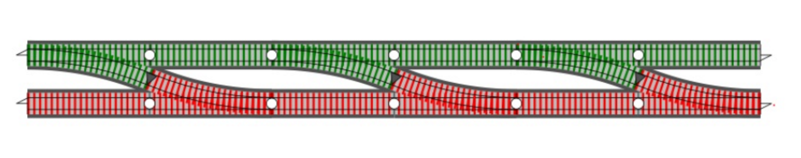
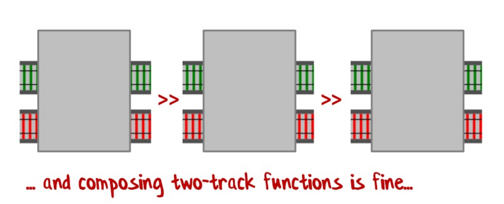

% Functional Programming
% Tyr Chen
% March 24th 2016

----

# What is functional programming?

----

> In computer science, functional programming is a programming paradigm—a style of building the structure and elements of computer programs—that treats computation as the evaluation of mathematical functions and avoids changing-state and mutable data. It is a declarative programming paradigm, which means programming is done with expressions.

# Languages you might know

* OOP: smalltalk, C++, java / C#, python / ruby
* Pure FP: haskell, erlang, F#, elixir, purescript, elm, ...
* Not-so-pure FP: clojure, common lisp
* Hybrid FP / OOP: scala, javascript

# Why functional programming?

----

```javascript
function getData(col) {
    var results = [];
    for (var i=0; i < col.length; i++) {
        if (col[i] && col[i].data) {
            results.push(col[i].data);
        }
    }
    return results;
}
```

# Problems

* We dictate computer the steps of doing things,
* we introduced (evil) state (result) and mutate it during the loop
* We will probably copy & paste:
    - if the condition changed for a simular problem
    - if the action changed for a simular problem
* it is not easy to get thinks right, especially the states are more than 10
* This code has no potential to run concurrently

----

How about this?

```javascript
function getData(col) {
    return col
        .filter(item => item && item.data)
        .map(item => item.data);
}
```

and this:

```javascript
function extract(filterFn, mapFn, col) {
    return col.filter(filterFn).map(mapFn);
}
```

and this:

```javascript
function extract(filterFn, mapFn) {
    return function process(col) {
        return col.filter(filterFn).map(mapFn);
    }
}
```

----

* We started to describe the problem we have
* Then we generalize it
* Then we rebuild it as a machine

# Let's talk a little bit about...math

* What is number?
    - what is integer?
    - what is fraction?
    - what is rational / irrational?
    - what is imaginary number? what does `i * i = -1` mean?
* What is currency?
* What is bank?
* ...
* What is program?

# A 'hard' problem

> My daddy's age is three times as mine, after ten years, it'll be twice as mine. How old am I? How old is he?

We all know this solution:

```javascript
y = 3x
y + 10 = 2(x + 10)
```

# Let's go further...

Can we generalize this problem? Yes.

```javascript
y = a1x + b1
y = a2x + b2
```

Then we have a generalized solution:

```javascript
x = (b2 - b1) / (a1 - a2)
```

# What does it mean?

## By generalizing a pattern, We created a machine that generates every solution if the problem falls into it.

# Now...let's go back to programming

* Do we want to write code that solve a single problem? Or do we want to create a machine to solve a series of problems?
* what can be the patterns to solve the problems?

----



# Some thoughts on programming

* Write programs that do one thing and do it well (Unix philosophy)
* And then compose them ([Rule of composition](https://en.wikipedia.org/wiki/Unix_philosophy#Eric_Raymond.E2.80.99s_17_Unix_Rules))
* Try to describe the problem, and hide the details
* Program should open for extension but close for modification (open-close principle)
* Try to avoid states

# Benefit

* Better design and implementation
* More readable code
* Robust solution for distributed systems (and potentially better performance!)

# Applying those thoughts

```javascript
const getComponentPath = (name, basePath) => path.join(basePath, name);
const getModelPath = getComponentPath.bind(null, 'models');
const getConfigPath = getComponentPath.bind(null, 'config');

const getConfigFile = (p, name) => path.join(getConfigPath(p), name);

const readTemplate = filename => fs.readFileAsync(filename, ENCODING);

const processTemplate = params =>
    promise => promise.then(content => mustache.render(content, params));

const writeFile = filename => 
    promise => promise.then(
        content => fs.writeFileAsync(filename, content, ENCODING)
    );

const processConfigTemplate = R.pipe(
      getConfigFile,
      readTemplate,
      processTemplate(PARAMS),
      writeFile(getConfigFile(topDir, 'config.yml'))
);

processConfigTemplate(topDir, 'config.mustache')
    .then(() => console.log('done!'))
    .catch(err => console.log(err));

```

----

Now it's time to enter the magic world of functional programming...

# Concepts

# Lamda caculus



* beta reduction: x ((ab)z)
* currying: ƒxyz.xyz = ƒx.(ƒy.(fz.xyz))

# First class function

> In computer science, a programming language is said to have first-class functions if it treats functions as first-class citizens. Specifically, this means the language supports passing functions as arguments to other functions, returning them as the values from other functions, and assigning them to variables or storing them in data structures

# High ordered function

> In mathematics and computer science, a higher-order function (also functional, functional form or functor) is a function that does at least one of the following:
> 
> * takes one or more functions as arguments (i.e., procedural parameters),
> * returns a function as its result.

# Pure function

> Purely functional functions (or expressions) have no side effects (memory or I/O)
>
> * dead code elimination: If the result of a pure expression is not used, it can be removed without affecting other expressions.
> * referential transparency: If a pure function is called with arguments that cause no side-effects, the result is constant with respect to that argument list
>     - memoization
> * Out-of-order execution: If there is no data dependency between two pure expressions, then their order can be reversed, or they can be performed in parallel and they cannot interfere with one another.
> * Compiler optimization: If the entire language does not allow side-effects, then any evaluation strategy can be used; this gives the compiler freedom to reorder or combine the evaluation of expressions in a program

# Curry


# Curry again

> In mathematics and computer science, currying is the technique of translating the evaluation of a function that takes multiple arguments (or a tuple of arguments) into evaluating a sequence of functions, each with a single argument.

```javascript
const getConfigPath = getComponentPath.bind(null, 'config');
```

# More concepts

* Functor
* Applicative
* Monoid
* Monad
* Catamorphism
* ...

[read this!](http://adit.io/posts/2013-04-17-functors,_applicatives,_and_monads_in_pictures.html) and [this](https://www.youtube.com/watch?v=-FkgOHvNAU8&list=PLwuUlC2HlHGe7vmItFmrdBLn6p0AS8ALX)

# Why so many concepts?

# Composition everywhere


----



# Example



----



----



# How to fix it?



----





# What is this? - Promise

```javascript
promise
  .then(...)
  .then(...)
  .then(...)
  .then(...)
  .catch(...)

```

# Q&A