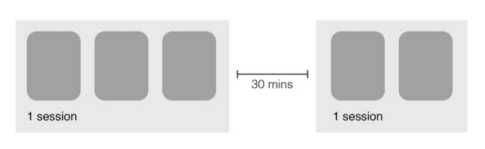

% Google Analytics
% Tyr Chen
% May 16th, 2016

# Why?

---

---

---

# What?

# Basic Concepts (1)

* Session
* new visitors
* returning visitors
* page views & unique page views
* Bounce rate: sessions only viewed 1 page

# Basic Concepts (2)

* Average session duration
* Average time on page
*

# Basic Concepts (3)

* Dimension: rows in table e.g. country, date, ...
* Metrics: columns in table e.g. sessions, DAU, ...

# How?
