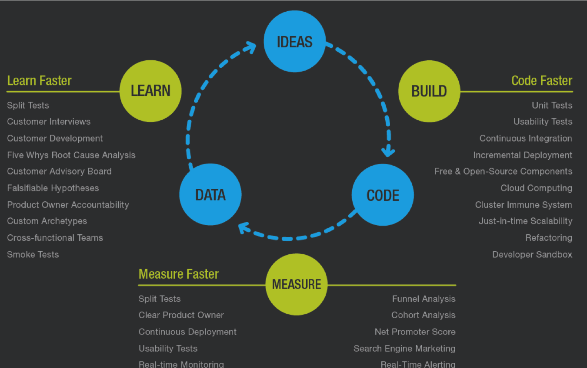
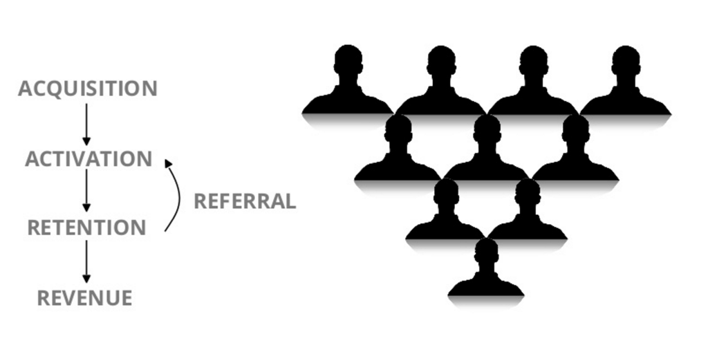
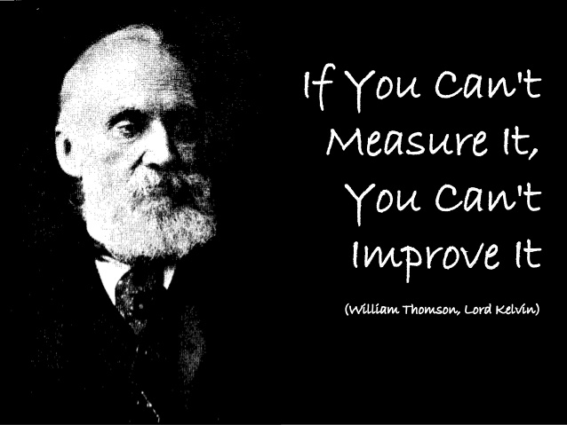

% Growth Basics
% Tyr Chen
% May 16th, 2016

# Why growth?

# Question: what after product?

---

# When to grow?

# How to grow?

# Steps

# Acquisition

> getting people to come to your product

* Organic search
* SEO / SEM / ASO (App Store Optimization)
* Content/wechat media account/blogs
* Email
* Social (viral)
* Partnerships
* PR
* Paid methods
    - search engine keywords
    - social media impressions
    - TV (??) impressions, etc.
* ...

# Customer Acquisition Cost (CAC)

* CAC = total cost / (direct users + viral users + organic users)
* Total cost is the cost for a campaign
* direct users are users acquired in this campaign
* viral users: users acquired by the referral of direct users
* organic users: user acquired as a side effect of the campaign

# How to track?

* We need to track the campaign (branch.io, etc.)
    - e.g. [Let's take autopilot as an example](http://www.capterra.com/campaign-management-software/)
* We need to track direct users and viral users
    - direct users must have a different URL source than viral users
* We need to have historical data for organic user growth data to calc new organic users
    - New organic users = Total new users - direct users - vial users - expected organic users

# Free channels are good, but...

We still need to throw money to the market to get targeted audiences:

* Brand
* Special events
* Massive acquisition
* NOTE: sustainable when LTV >= UAC

# How to spend money?

* press releases
* Campaigns in new media: search engine, social media, etc.
* Campaigns in traditional media: TV, news paper, etc.
* Burst Campaigns: to achieve a goal that we got massive users in a short time

# Core paid media pricing models (in a campaign)

* CPI/CPM (Cost per Impression / per thousand impressions): user sees banner ads
* CPC (Cost per Click): user clicks banner ads
* CPI (Cost per Install): user installs an app
* CPA (Cost per Action): user successfully performs an action (e.g. follow wechat, forward a post)

# Precise targeting

* Demographic
    - I want users who live in Bei-Shang-Guang-Shen, age 28 - 45, females
* Characteristics
    - I want users who reads travel blogs, websites
* Behavior
    - I want users who go abroad for family travel at least 1 time  each year

# Life Time Value (LTV)

* LTV is projected revenue that a customer will generate during their lifetime
* LTV = annual profit per customer x average year customer retain x (customer / user  ratio)
    - e.g.: (3500 * 40%) x 3 x 0.5% = 1400 x 3 x 0.5% = 21
* What is the LTV of starbucks you think? [click me](https://blog.kissmetrics.com/wp-content/uploads/2011/08/ltv.png)

# How to track?

* MPO (Monthly paying order) / MR (Monthly revenue) / gross profit
* User flow
* Conversion
* Retention

# More on conversion

# User Engagement

> Engagement: getting people to really **use** your product

* Is it signup? Is it to download your app? ...
    - For daydream (at this stage), it should be at least trying to order
* sending weekly (monthly) product intro email
* push notification on all kinds of sales
* motivate loyal user to bring in new paying user
    - ref: uber, digitalocean, etc.

# Retention

> Retention: getting users to become loyal

* Define loyalty (important!!!)
    - recurring visitor?
    - engage with products actively?
    - booked day tours >= 2?
* Know what loyalty looks like (tracking data)
* identify factors that affect customer loyalty
* Earn customer's trust
    - build a community (e.g. share experiences, morning call)
    - customer satisfaction
    - make customer feel respected (e.g. frontapp)
* NOTE: 5% retention raise leads to 25% - 100% LTV increase

# Monetization

# Monetization: how business make the money

* ARPU: Average Revenue Per User
* ARPPU: Average Revenue Per Paying User
* MRR: Monthly Recurring Revenue (may not apply to our business model)
    - but think about how to make it? (e.g. amazon prime)
* Churn rate (attrition rate): customer lost / new customer
    - not applied to us right now but it is important

# Endorsement (referral)

# Endorsement: getting people to **share** our product

* provide them weapons
    - tools for sharing to weibo / wechat / 朋友圈
    - tools for sharing to youku / nice
    - tools to write feedback, like, etc.
    - tools to convert their raw material to a better, viral media (e.g. 锤子便签)
* incentive for them to endorse
    - dream point (e.g. 飞屋环游记)

# Growth hack

# What?

# Tenents of growth hack

* Obsess over data
    - know customers exceptionally well
    - measure everything
* Creativity
    - Think different (ref: hotmail, dropbox)
    - Leverage giants (airbnb vs craigslist, youtube vs myspace)
    - Push the limits
* Curiosity
    - build - measure - **learn**
    - get out of building
* Dirty hands
    - get into product and code and make

----

# Case Study - hotmail

# Case Study - airbnb

# Case Study - dropbox

# Data in GA (probably next topic)

* Session
* new visitors
* returning visitors
* page views & unique page views
* Bounce rate: sessions only viewed 1 page
* Average session duration
* Average time on page

# Dashboard

* No one dashboard suites all
* Company Dashboard: overall KPI
* Growth team dashboard: very detailed growth data
* Product dashboard: experiment/feature related dashboard
* Marketing dashboard: UAC / LTV / channel effectiveness

# Dashboard demo

use [amplititude](https://amplitude.com) as an example, it doesn't mean I recommend it.

# Q&A
