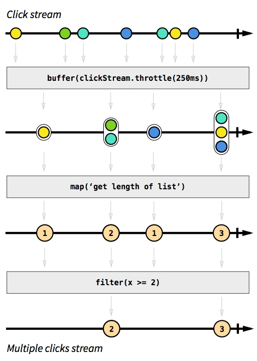
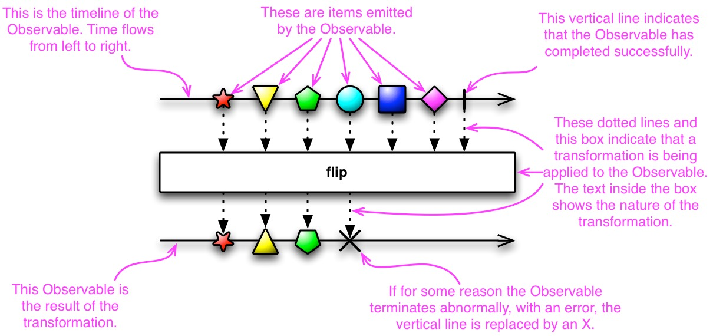
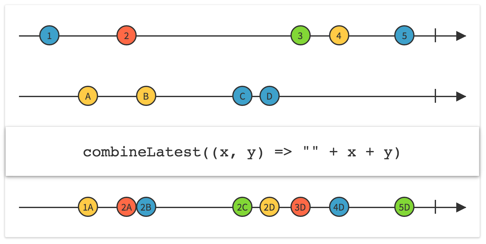

% Handle complex async problems
% Tyr Chen
% Feb 11th, 2015

----

# A bright world

In a synchronous world, everything is harmonious...

```javascript
function crawlSync(urls) {
  return urls.map(url => {
    try {
      return {
        url,
        body: request.getSync(url)
      }
    } catch(e) {
      logger.warn('url %s cannot be retrieved', url);
      return {
        url,
        body: null
      }
    }
  });
}
```

---

## But, how to handle the same request in an asyncronous world?

# First try

```javascript
function crawl(urls) {
  return urls.map(url => {
    request.get(url, (err, response, body) {
      // for simplicity we don't process 3xx
      if (err || response.statusCode !== 200) {
        logger.warn('url %s cannot be retrieved', url);
        return {url, body: null};
      }
      return {url, body: body};
    });
  });
}
```

# Does it work?

# Second try

```javascript
function crawl(urls) {
  return urls.map(url => {
    return new Promise((res, rej) => {
      request.get(url, (err, response, body) {
        if (err || response.statusCode !== 200) {
          logger.warn('url %s cannot be retrieved', url);
          res({url, body: null});
        } else {
          res({url, body: body});
        }
      });
    });
  });
}
// then use Promise.All()
```

# Does it work?

# Third try

```javascript
function crawl(urls) {
  const results = [];
  const crawlOne = function(idx) {
    if (idx >= urls.length - 1) return;

    const url = urls[idx];
    request.get(url, (err, response, body) {
      if (err || response.statusCode !== 200) {
        logger.warn('url %s cannot be retrieved', url);
        results.push({url, body: null});
      } else {
        results.push({url, body: body});
      }
      carwlOne(idx + 1);
    });
  }
  crawlOne(0);
}
```

# Does it work?

# Yeah, but ugly

* recursive code is hard to read and modify
* what if urls is a really big array? 1M?

---

# Conclusion

* Dealing with a sequence of asynchronous data is hard and error-prone!
* we need to consider:
    * race condition
    * memory leak (especially on event handler)
    * complicated state machine (or internal states)
    * error handling 

# One more example...

* In synchronous world, we generate:
    * array: [1, 2, ...]
* In an asynchronous world, we have:
    * promises: [P(1), P(2), P(3)], and we have Promise.All()
* But the real world is a mixture:
    * [1, P(2), P(3), 4, 5, ...], how do we handle that?
    * new Promise(res => res(1))?

---

Don't forget that a Promise is a value that will be either resolved or rejected in future, that once you fire it, you lose control.

```javascript

> p = new Promise(res => {
>   setTimeout(() => { console.log('fired!'); res('fired'); }, 5000);
> });
Promise { <pending> }
> fired!

> p
Promise { 'fired' }

```

---

## It's a miserable world, we need better weapon!

# Observable

# What is Observable?

datatypes that represent a value 'over time'


----



----



# Traits

* similar as array, array of future data, we call it ``stream``
* pub / sub
* supported by major languages (java, swift, js, python, clojure...)
    * learn once, write anywhere
* rich operations (over 100+ operations)
* lazy, functional, composable

---

```javascript
function crawl(urls, numRetries) {
  return Rx.Observable.from(urls)
    .map(url => {
      return Rx.Observable.create(observer => {
        request.get(url, (err, response, body) {
          if (err || response.statusCode !== 200) {
            observer.onError({url, err});
          } else {
            observer.onNext({url, body: body});
          }
          observer.onCompleted();
        });
      })
      .retry(numRetries)
      .catch(err => {
        logger.warn('url %s cannot be retrieved: %s', err.url, err.err);
        return Rx.Observable.empty();
      });
    })
    .concatAll();
}

cawl(urls, 3).subscribe(
  data => console.log(data),
  err => console.log(err),
  () => console.log('Done!')
);
```


# How to create

* Rx.Observable.from()
    * fromArray, fromCallback, fromPromise, fromEvent, etc.
* Rx.Observable.just / never / empty / throw / range / etc.
* Rx.Observable.interval / repeat / timer / etc.
* Rx.Observable.create()

---

```javascript
const extractLogObservable = function(filename) {
  return Rx.Observable.create(observer => {
    const reader = readline.createInterface({
      input: fs.createReadStream(filename)
    });
    reader.on('line', line => {
      observer.onNext(line);
    }).on('close', () => {
      observer.onCompleted();
    });

    return function() {
      reader.close();
    }
  });
}
```

---

## How to transform

* map
* flatMap
* groupBy
* scan
* buffer
* window

---

## map


---

## flatMap

transform the items emitted by an Observable into Observables, then flatten the emissions from those into a single Observable


---

## groupBy

divide an Observable into a set of Observables that each emit a different subset of items from the original Observable


---

## scan


---

## Buffer

periodically gather items emitted by an Observable into bundles and emit these bundles rather than emitting the items one at a time


---

## window

periodically subdivide items from an Observable into Observable windows and emit these windows rather than emitting the items one at a time


# How to filter

* filter
* debounce
* distinct
* sample
* take
* skip

---

## filter


---

## debounce

only emit an item from an Observable if a particular timespan has passed without it emitting another item


---

## sample

emit the most recent items emitted by an Observable within periodic time intervals


---

## distinct

suppress duplicate items emitted by an Observable


---

## How to converge

* merge / mergeAll
* concat / concatAll
* combineLatest
* switch / switchLatest

---

## merge

combine multiple Observables into one by merging their emissions


---

## concat

emit the emissions from two or more Observables without interleaving them


---

## combineLatest

when an item is emitted by either of two Observables, combine the latest item emitted by each Observable via a specified function and emit items based on the results of this function



---

## switch

convert an Observable that emits Observables into a single Observable that emits the items emitted by the most-recently-emitted of those Observables


# Cold v.s. Hot

# publish

convert an ordinary Observable into a connectable Observable


---

## Enough concepts! Let's look at code!

# [Typeahead](https://s3-us-west-2.amazonaws.com/eng-assets/slides/reveal/assets/code/index.html)

```javascript
const throttledInput = Rx.DOM.keyup($search)
  .pluck('target', 'value')
  .filter(text => text.length > 2)
  .debounce(500)
  .distinctUntilChanged();

function searchWiki(text) {
  const url = 'https://en.wikipedia.org/w/api.php?action=opensearch&format=json&search='
    + encodeURIComponent(text) + '&callback=JSONPCallback';
  return Rx.DOM.jsonpRequest(url).retry(3);
}

const suggestion = throttledInput.flatMapLatest(searchWiki);

suggestion.subscribe(
  data => {
    const results = data.response[1];
    clearSelector($results);
    results.forEach(appendChild);
  },
  e => {
    clearSelector($results);
    appendChild(`Error: ${e}`);
  }
)
```

# Real world example (1)

* Problem: generate HLS link by video ID
* Solution

```javascript
function reGenerateHLSByIdList(videoIdList) {
  Logging.inf(MOD, 'Start generating hls links for %s videos.', videoIdList.length);
  function generateByIds() {
    return Rx.Observable.fromArray(videoIdList).map(function (item) {
      var videoId = item.video_id;
      return Rx.Observable.create(function (observer) {
        Business.video_transcode_uploaded_to_cdn.generateHLSLinkForVideo(videoId, function (err) {
          if (err) {
            Logging.err(MOD, 'Generating hls link for video %s failed due to: %s. Go to next one.', videoId, err);
          }
          observer.onNext(videoId);
          observer.onCompleted();
        });
      });
    }).concatAll();
  }

  generateByIds().subscribe(function (data) {
    Logging.inf(MOD, 'Finish generating hls links for video %s', data);
  }, function (err) {
  }, function () {
    Logging.inf(MOD, 'Finish generating hls links for %s videos.', videoIdList.length);
  });
}
```

# Real world example (2)

* Problem: we need to load paginated categories
    * first load all categories
    * load the 1st page of each categories
    * load more pages once a category is focused
* Solution:
    * loadAllCatObservable.flatMap(loadCat(url, 1))
    * Rx.Observable.fromEvent(focusEvent).filter(isLoaded(page)).map(loadCat(url, page)).switchLatest()


# Q & A