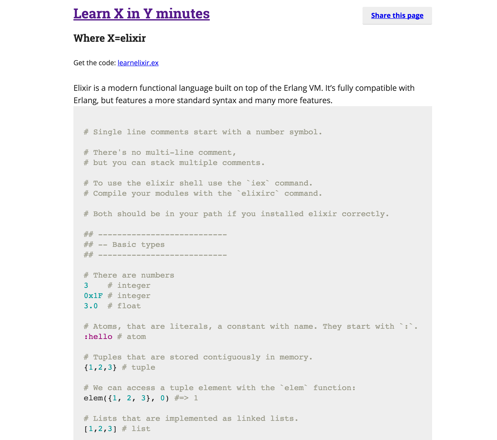
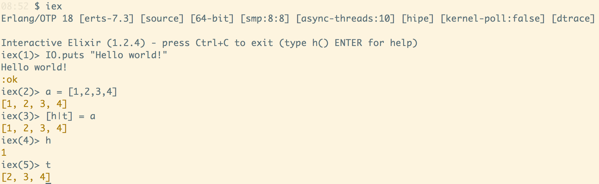

% Learn a new language
% Tyr Chen
% April 29th, 2015

----

# Why?

# Benefits

* good for your brain - paradigm shift
* alternative solutions - more choices
* more efficient sometimes - productivity


# Paradigm shift

* forloop -> recursive
* if else -> query (prolog), pattern matching
* mutable -> immutable
* OOP     -> FP
* imperative -> descriptive
* key     -> atom
* ...


# More choices

* lock: CSP, actor, STM, async
* homebrewed algorithms: built in pattern matching
* ...

# productivity

* languages have their tradeoffs, they don't excel in all problems
* engineering productivity v.s. runtime efficiency
* ...

# What?

* static typing <-> dynamic typing
* parser based <-> compiler based
* object oriented <-> functional oriented
* backend related <-> frontend related
* non softeware realtime <-> software relatime

# How?

1. Learn X in Y minutes
2. Try grammar and basic data types in the REPL (if any)
3. Learn the history (and inspiration) of X (mostly youtube videos)
4. Try koans and exercise for X
5. Get familiar with package management system
6. Read language writers (or contributors)' books (if possible)
7. Build a demo project from scratch
8. Build a demo project use the most-stared-github starter kit (if any)
9. Read good open source projects (and think how and why)
10. Contribute to open source projects (send the f**king pull requests)
11. Build a more serious project
12. Compare with other Languages
13. Teach it
14. Go back to step 9

# Let's take elixir as an Example

# Why and what?

* functional programming
* concurrent model: actor
* paradigm shift: pattern matching, macro, compile, software realtime
* expressiveness and productivity

# Learn X in Y minutes

* https://learnxinyminutes.com/docs/elixir/



# REPL

```bash
$ brew install elixir
$ iex
```


# Learn the history

* elixir is based on erlang vm
* erlang is developed in Ericsson, by Joe Armstrong
* Erlang VM (BEAM) is a soft realtime VM (beat JVM)
* adopted thoughts from functional programming world and prolog
* a REAL "OO" language (thanks smalltalk) that passing message with actor model (thanks Carl Hewitt)
* extremely fast pattern matching engine
* elixir extended erlang with beautiful grammar (ruby-like), and powerful macro
* a monster - phoenix framework is created based on elixir - expressiveness of rails, [performance of ??](https://github.com/mroth/phoenix-showdown#comparative-benchmark-numbers)
* very situable for C10M challenges: [scaling to 2M websockets](http://www.phoenixframework.org/blog/the-road-to-2-million-websocket-connections)


# Koans & Exercise

* https://github.com/dojo-toulouse/elixir-koans
* https://github.com/iamvery/elixir-koans.git
* http://exercism.io/languages/elixir

# Demo elixir-koans

# Package management system

* when you want to go deeper, you need to know how to leverage existing wheels
* elixir has mix, as node has npm, python has pip, clojure has lein, java has maven etc.
* Usage:

```bash
$ mix deps.get
```
* Example (pretty similar as what you got for package.json of npm)

```elixir
defp deps do
  [
    {:phoenix, "~> 1.1.2"},
    ...
    {:comeonin, "~> 2.0"},
    {:guardian, "~> 0.9.0"},
    {:credo, "~> 0.2", only: [:dev, :test]},
    ...
    {:mix_test_watch, "~> 0.2", only: :dev}
   ]
end
```

# Book about elixir

All following books could be borrowed from Sunnyvale library (I bet library in your town has those as well), in the form of either a real book, or ebook

* [Elixir online docs](http://elixir-lang.org/)
* [Programming erlang](https://pragprog.com/book/jaerlang2/programming-erlang)
* [metaprogramming elixir](https://pragprog.com/book/cmelixir/metaprogramming-elixir)(Chris McCord)
* [Programming phoenix](https://pragprog.com/book/phoenix/programming-phoenix)(Chris McCord, Bruce Tate, and José Valim)

# Build

* build demo project from scratch
* build demo project with starter kit

# Read good open source projects

* [Plug](https://github.com/elixir-lang/plug)
* [Ecto](https://github.com/elixir-lang/ecto)
* [Phoenix](https://github.com/phoenixframework/phoenix)
* [Find interesting projects in awesome series](https://github.com/h4cc/awesome-elixir)

# An example: Chinese translation

* [Chinese translation](https://github.com/tyrchen/chinese_translation)
* Build by a guy named Tyr Chen
* Translate traditional Chinese to simplified Chinese, or vise versa, based on [wikipedia's latest translation data](http://svn.wikimedia.org/svnroot/mediawiki/trunk/phase3/includes/ZhConversion.php).
* Translate Chinese words to pinyin, based on the data collected by [janx/ruby-pinyin](https://github.com/janx/ruby-pinyin)
* Slugify Chinese words (or pinyin)

---

### If you have ever worked on slugify for Chinese, you know it's hard

* However:

```elixir
iex> ChineseTranslation.slugify("长工长大以后")
"chang-gong-zhang-da-yi-hou"

iex> ChineseTranslation.slugify("长工长大以后", [:tone])
"chang2-gong1-zhang3-da4-yi3-hou4"

iex> ChineseTranslation.slugify("長工長大以後", [:trad, :tone])
"chang2-gong1-zhang3-da4-yi3-hou4"

iex> ChineseTranslation.slugify(" *& 我是46 848 中 ----- 国人")
"wo-shi-zhong-guo-ren"
```

# DEMO

---

### How does this achieved?

* inspired by exlir's own upperCase/lowerCase transition
* It downloads latest data from wikipedia
* Then generated tens of thousands simple functions for 1 to 1 translation __at compile time__
* erlang VM will optimize those functions as a binary search tree with its high performance pattern matching engine
* At run time, it just leverage the pattern matching engine
* How would you conquer this problem in javascript, java, ...?
* Now think about a route engine...

# Compare with other language

* elixir vs erlang
* elixir vs clojure (macro)
* elixir vs haskell (functional programming)
* elixir vs go (concurrency model)
* elixir vs ruby (expressiveness)
* ...

# Teach it!

* Most effective learning approach
  - learning by practising
  - learning by teaching
* See, I'm doing this right now!

# That's it!

---

### Head fake: am I talking about elixir?

---

### Head fake II: am I talking about how to learn a new language?

---

# Thanks & Q/A
