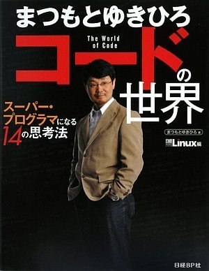

% My views on engineering / Managing
% Tyr Chen
% Dec 8th, 2015

# Why?

# What's my focus?

* Engineering
* Managing
* Eng culture (next topic)
* Goals and plans

# Engineering

# A story

Schlemiel the Painter's Algorithm


# My engineering principles

* Build - Measure - Learn
* DRY (Don't repeat yourself)
* Open-closed Principle
* More descriptive code, less imperative
* Make small contributions
* Use/Build tools wisely
* Proud to be the owner

----


* Fail early fail fast, and learn fast (experience)
* Deploy often

# DRY

* No ``copy & paste``, refactor when necessary
* No repeat manual steps, automate if possible




# Open-closed

* Software should open for extension, close for modification
* Separate data (rules) from code (thinking in lisp way)

Not good:

``` javascript
for (...) {
    if (...) {
        // do some stuff
    } else if (...) {
        // do other stuff
    } else if (...) {
        ...
    }
    ...
}
```

# Open-closed

Good:

``` javascript
var filterWithActions = [{ // extracted data from code
    filter: filterFN1, // filterFN / ActionFN is your lego blocks
    action: actionFN1
}, ...]
iterate(iterable, filterWithActions)
```

implementation of ``iterate()``:

``` javascript
iterable.map(item => {
    for (var entry of filterWithActions) {
        if (entry.filter(item)) {
            entry.action(item);
            break;
        }
    }
})
```

# Descriptive code

* more transformation, less mutation


[The original talk by Rich Hickey - highly recommend!](https://www.youtube.com/watch?v=rI8tNMsozo0)

# Descriptive code

``` javascript
// filters: [ [f1, f2], [f3, f4, f5], [f6], ... ]
function findNode(node, rules) {
  const middlewares = rules.map(rule => {
    const filters = rule.filters;
    const funcs = filters.map(items => R.allPass(items)); // AND for inner filters
    const test = R.anyPass(funcs); // OR for outer filters

    return function middleware(n, idx) {
      if (test(n)) rule.results.push({node: n, index: idx});
    };
  });

  traverse(node, middlewares);

  rules.forEach(rule => rule.transform(rule.results));
  return rules;
}
```

# Make small changes

* Big task: divide and conquer
* Iterative improvement
* Commit and merge daily
* feature toggle

# Use/Build tools wisely 

* Tools matter!
* Find suitable tools first, then build our own
* Let information find you!

# Proud to be the owner

* Code/product is your own baby
* Is it really awesome?
    - definition of awesomeness
* Never let the "customer" down
* I don't know the answer __yet__
    - but I'll figure out
* Let others contribute if you're blocking their way
    - Open source model - owner is the gatekeeper

# Managing

----

> To manage yourself, use your head
> 
> To manage others, use your heart

# Principles I value

* Trust over Control
* Commitment over Compliance
* Data over Authority
* Lead by Example

# My major practices

* Setting objectives
* Motivating & aligning effort
* Coordinating activities
* Developing people
* Hiring and attracting talents
* Accumulating & sharing knowledge
* Building & nurturing relationships
* Thinking about the future

# Setting objectives

* eng roadmap 2016
* engineering processes
* technical directions

# Motivating & aligning effort


# Coordinating activities

# Delevoping people

* Mentorship
* Seek for external training opportunities
* Define technical ladder / leadership pipeline
* Send people for meetup / conferences
    - WWDC, AWS re:invent, StrangeLoop, etc.

# Hiring and attracting talents

* Hiring
    * Head count plan
    * Work with Katie to find talents
    * Use social network
* Attracting (make ourselves attractive)
    * Let the products talk!
    * Write team blog (and submit to hacker news, reddit, etc.)
    * Give meetup/conference talk

# Accumulating & sharing knowledge

* Knowledge system (jira, confluence, etc.)
    - jira is Dumbledore's pensieve
* Weekly Brown Bag Lecture (BBL)
* Monthly Retrospective
* Team blog

# Building & nurturing relationships

* 1:1 talk
* Monthly Retrospective

# Thinking about the future

* If ... then questions
* Keep an eye on technical evolution
    - can ABC solve our problem?
    - how to build a PoC for XYZ?

# Goals & Plans

# My Time Allocation

* Team/project management (35%)
* People development (25%)
* Architecture, design, and review (20%)
* Coding (20%)

# One month plan (2015)

* Learn
    - Know the business requirements and feature roadmap
    - Know the architecture of the system
    - Know our current processes
* Build trust
    - Catch up chat to know each other deeply
* Observe and follow up
    - Understand where we are and what to do

# One month plan

* Add a little bit processes
    - git workflow
    - pre-codereview/post-codereview
    - dummy CI pipeline
    - artifactory repository for build targets
* Make a plan for improvement
    - tech debts
    - performance
    - scalability
    - security

# One month plan

* Prepare for 10x growth
    - Are we there yet?
    - what's missing? (technology, resources)
    - How do we challenge the status quo?

# We will see...

* A git flow (ongoing)
    - currently tried on android / cms
    - branching convention
    - pull request & code review
* Integrations among jira, github, slack, jenkins (ongoing)
* A set of activities (to be started):
    - weekly BBL
    - sprint demo (end of every sprint)
    - monthly retrospective
* eng plan for 2016 (done)

# Goals for 2016

We're still in the middle of the planning, it'll be anbitous

* Deliver
    - The product roadmap
    - The engineering roadmap
    - An archtect sustains our growth
* Improve
    - Code quality
    - Engineering efficiency
    - Engineering culture

# Another story


[Believe is self-fulling prophecy](https://www.youtube.com/watch?v=IwUecXRvnS0)

# Talk is cheap, let's deliver!

# Q & A