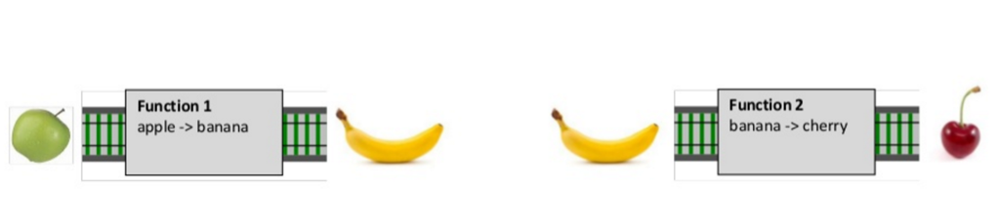

% Pipe
% Tyr Chen
% July 8th, 2016

----

# What is a pipe (pieline)?

> a pipeline is a sequence of processes chained together by their standard streams, so that the output of each process (stdout) feeds directly as input (stdin) to the next one - from [Pipeline(unix) - wikipedia](https://en.wikipedia.org/wiki/Pipeline_(Unix))

```bash
$ ls -l | grep key | less
$ tail -f /var/log/nginx/xxx.access.log | bunyan | grep -A 5 -B 5 ERROR
```

# Philosophy backed pipe

* Unix philosophy

    * Write programs that do one thing and do it well.
    * Write programs to work together.
    * Write programs to handle text streams, because that is a universal interface.

* functional programming philosophy

    * Composition, Composition, Composition!

# Benefit

* just need to focus one thing at a time (divide and conquer)
* cleaner code base
* reusability
* Testability

# Languages/Libraries support pipe

* languages
    * java: Pipe class (java 7)
    * python: no direct support, functools has ``compose``, ``macropy`` has ``|``
    * clojure: ``pipe`` or ``->``
    * scala, F#, elixir: ``|>``
        * elixir has both Enum and Stream (lazy) interfaces for piping
    * javascript: ``R.pipe`` in ``ramda``, nodejs builtin stream support, highland.js
* Libraries
    * ReactiveX


# An example of a language

```elixir
# code is from: https://github.com/tyrchen/chinese_translation
defp to_slug(data, with_tone \\ false) do
  data
    |> String.split
    |> Stream.map(&(normalize_slug(&1, with_tone)))
    |> Enum.join(" ")
    |> String.replace(~r/[^a-z1-4]+/, "-")
    |> String.strip(?-)
end

def get_trans_data do
  @filename
    |> get_file_content
    |> match
    |> Enum.map(fn([_whole, name, content]) -> {name, parse(content)} end)
    |> Enum.into(%{})
end
```

# Common patterns

* pipe for a single value
* pipe for multiple values
* pipe for a single future value (async)
* pipe for multiple future values (async)

# Pipe for a single value

Let's see an example with pseudo code:

```elixir
  input |> function1() |> function2() |> function3.apply('abc')
```

* These rules apply to this kind of pipe:

    * the function in the pipeline takes only one param (use currying if more than one)
    * each function in the pipeline should be able to consume the output of previous function

      

* The functions could be more general if we apply this:

    * the function in the pipeline return same type as input (monoid)

      

# Pipe for a single value (how to)

* when we write function, consider the **position** of arguments. Carefully crafted functions will make it is easier to pipe.

```javascript
function open(encoding, filename) {
  return fs.readFileSync(filename, encoding)
}

function process(content) {
  // do whatever transformation of content
  return content;
}

R.pipe(
  open.bind(null, 'utf8'),
  process,
  fs.writeFileSync.bind(fs, 'output.txt')
)
```

# Pipe for multiple values

Again, example first:

```elixir
dataSet |> map(transform1) |> map(transform2) |> filter(condition) |> httpResponse.write
```

* Similar processing as piping single value
* pipe can be chained only if the each function is a monoid
    * map / filter meets this rule
    * reduce breaks this rule (e.g. sum, aggregate, etc.)
* laziness is very important (what container should we pick)
    * array
    * stream

# Pipe for multiple values (how to)

* container to choose (use js as example)
    * array (normal operation, good for small data sets)
    * nodejs stream (stream operation)
    * [highland.js](http://highlandjs.org/) (a utility belt on top of nodejs stream)
* for other language please do research yourselves

```javascript
const _ = require('highland');
_([1, 2, 3, 4, 5])
  .map(x => x * 3) // transformation
  .filter(x => x % 2 === 0) // select data set we want
  .toArray(xs => console.log(xs)) // reduce
```

# Pipe for multiple values

This is a live example how we do full index for our data into our search server:

```javascript
const stream = collection.find({}, SELECTED_FIELDS).stream();
const transformStream = new TransformStream({ mapping, type });
const batchStream = new BatchStream({ size: BATCH_SIZE });
const indexStream = new IndexStream({ appId: APP_ID, appKey: APP_KEY, indexName: INDEX_NAME });

stream
  .pipe(transformStream)
  .pipe(batchStream)
  .pipe(indexStream);

indexStream.on('data', content => {
  console.log(`${content.taskID}: processed ${content.results.length} items`);

});

indexStream.on('end', () => {
  console.log('done!');
  process.exit(0);
});
```

# Pipe for a single async value

Example:

```javascript
// promisy way:
promise.then(data => transform1(data)).then(data => transform2(data))
// or express way:
middleware1() { ...; next(); }
middleware2() { ...; next(); }
```
* A proper control flow is important (``next()`` in express or ``then()`` in promise)

# Piple for mulitple async values

Example:

```javascript
request.pipe(response);
socket.pipe(socket);
Observable
  .map(transform1)
  .flatMap(transform2)
  .filter(transform3)
  .subscribe(reducer);
```

* proper hooks to access single value from async stream is important
    * nodejs stream has ``on('data')``
    * rxjs has ``onNext()`` and a set of operations
* for more about rxjs Observable see [this](http://eng-assets.s3-website-us-west-2.amazonaws.com/slides/reveal/handle-complex-async-problems.html#/observable)

# Dealing with mixed situations

now we have some ideas how to "pipe" various data through a list of functions, but the real world is full of mixed situations...


# More on stream

* nodejs specific but knowledge is general
* readable stream
    * one can ``push`` data into stream so that others can ``read`` (can pipe from a readable stream)
    * nobdy cannot write to readable stream (cannot pipe to a readable stream)
    * based on event emitter (you can do ``on('data')``, ``on('error')``, and ``on('end')``)
* writable stream
    * one can ``write`` data into stream (can pipe to a writeable stream)
    * one cannot read from writeable stream (cannot pipe from a writeable stream)
* duplex stream
    * like a tcp connection, you can read/write on both ends
    * ``socket.pipe(socket)`` - a simplest echo server
* transform stream
    * a uni-direction readable/writable stream, which transform input to output
    * ``socket.pipe(split).pipe(socket)`` - a echo server splits input data out output it. Here ``split`` is a transform stream.

# A close look at transform stream

```javascript
class BatchStream extends ObjectTransform {
  constructor(options) {
    options = options || {};
    super(options);
    this.batchSize = options.size || BATCH_SIZE;
    this.batch = [];
  }

  // upstream has new data
  _transform(chunk, encoding, callback) {
    this.batch.push(chunk);
    if (this.batch.length >= this.batchSize) {
      this.push(this.batch);
      this.batch = [];
    }
    callback();
  }

  // upstream is going to close the stream
  _flush(callback) {
    if (this.batch.length) {
      this.push(this.batch);
      this.batch = [];
    }
    callback();
  }
}
```

# Q&A


