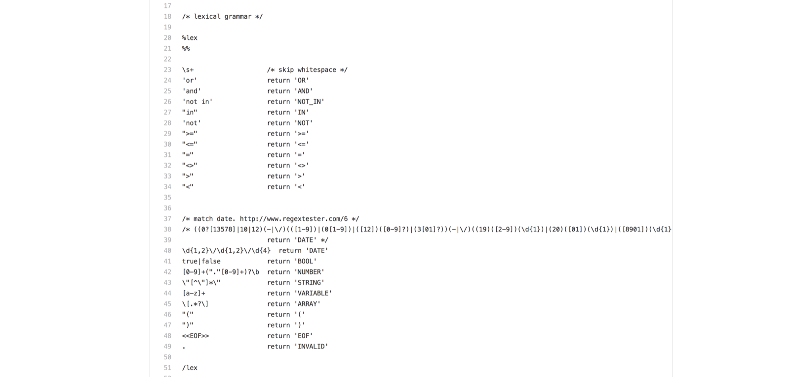
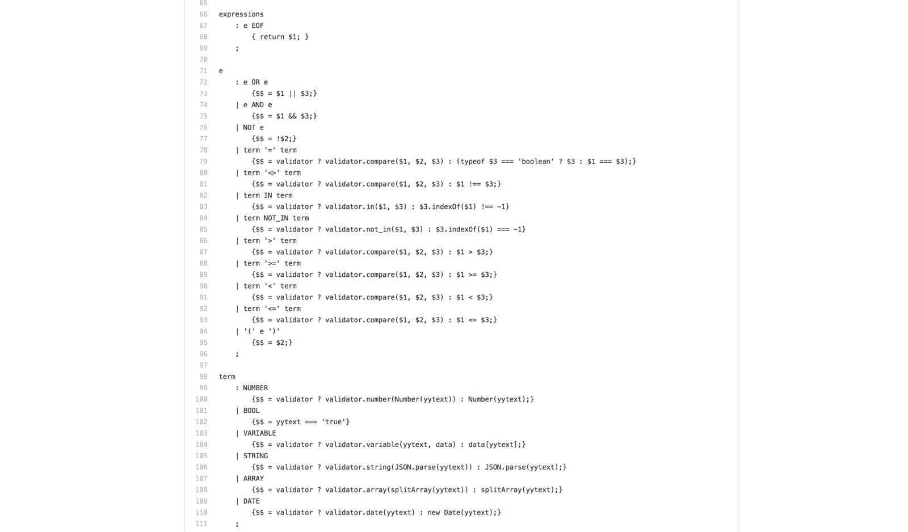
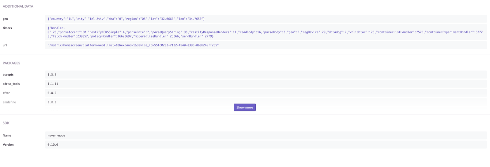
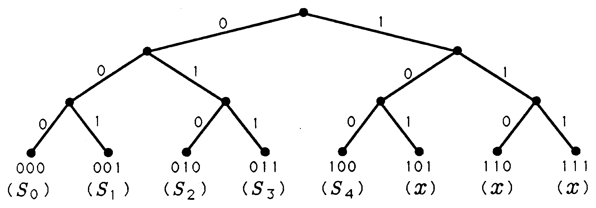
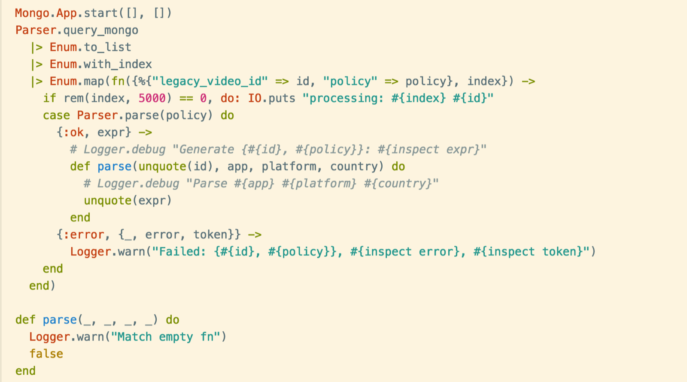

% Policy Engine \n<br/>frome db, to BNF, then to binary tree
% Tyr Chen
% Jan 5th, 2017

# Policy engine history

* Old CMS UI: database / redis query - highly inefficient
* UAPI: BNF based rule parser
    * working, fast for single check
    * but we soon see performance penalty with over 100 items
* What's the future?
    * Optimized binary tree?

# Let's take a look at BNF solution

# what is BNF?

> In computer science, Backus–Naur form or Backus normal form (BNF) is a notation technique for context-free grammars, often used to describe the syntax of languages used in computing, such as computer programming languages, document formats, instruction sets and communication protocols. They are applied wherever exact descriptions of languages are needed: for instance, in official language specifications, in manuals, and in textbooks on programming language theory.

# Lex



# Bison



# Jison (for javascript)

We use Jison for rule parser, see: https://github.com/adRise/rule-parser


# Why is it slow?



* database issue?
* Linear performance? O(N)

# Performance consideration

* short form contents grow insanely - we need O(log(N))


# Which algo is O(log(N)), seriously?

# So we need an optimized binary tree?



# Great, but...

* we have all those policy expressions
* we have tools built around policy expressions
* how to parse expressions to tree?
* a week's task? a two-week task?

# Elixir to rescue

* it supports quote / unquote (macros)
    * which implies we can easily convert our policy to code
* it supports pattern matching (erlang)
    * erlang pattern matching is an optimized binary tree
    * which implies we can generate tens of thousands functions to leverage pattern matching

# Show me the code



# Explanation

It reads database and generate 100, 000 functions like this:

```elixir
def parse(105716, app, platform, country) do
  unquote({:and, [line: 1],
   [{:==, [line: 1], [{:app, [line: 1], nil}, false]},
    {:==, [line: 1], [{:country, [line: 1], nil}, ["US", "CA"]]}]}）
end

...

def parse(_, _, _, _) do
  false
end
```

# Demo

# Performance comparison

**javascript**

```
11:54 $ ./cli test-policy
Done! Total 488, Spent 794ms
```

**elixir**

```
12:14 $ mix policy_check
12:18:15.397 [warn]  Match empty fn
12:18:15.398 [warn]  Match empty fn
12:18:15.398 [warn]  Match empty fn
Total 488, spent 56.162ms
```

It could be made even faster...since I haven't use eilxir's concurrency stuff

# What's missing

* Build takes 10 mins (Need to make is fast - use Expriment.Flow)
* Every hour rebuild it (so that new contents can be supported)
    * can we do incremental code generation? seems no
* Hot load the new module so no service interruption (erlang VM supports that)
* API bridge


# Q&A
