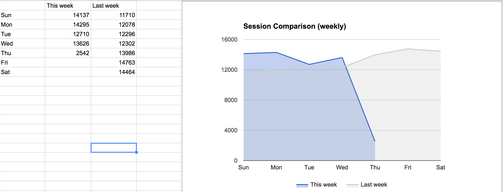
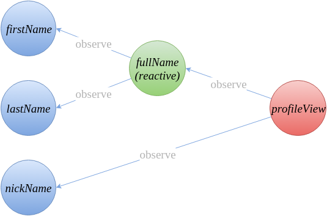
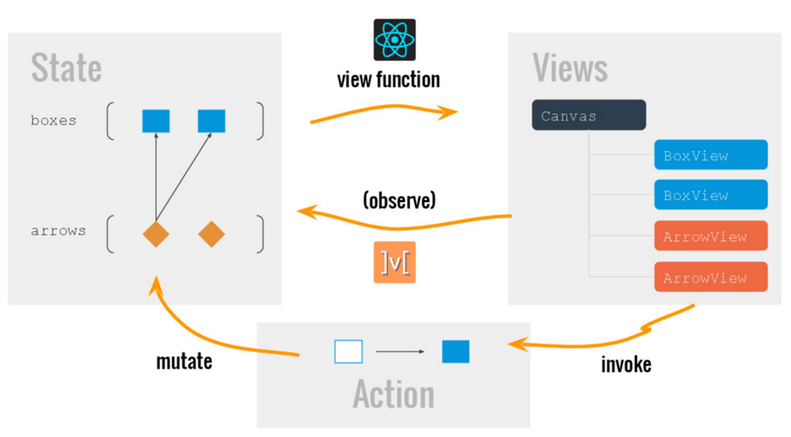
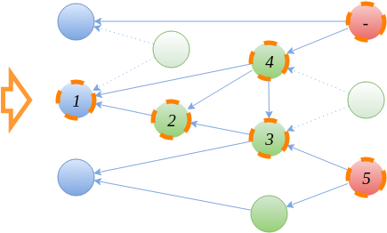

% Reactive programming
% Tyr Chen
% June 9th, 2015

----

# A journey back to spreadsheet

[](https://docs.google.com/spreadsheets/d/1IE_3myk0dlIrV-x8UbC1kAwuVqukrSrUy8a03aDgoRk/edit#gid=1244714308)

----

### spreadsheet is a dreaming programming lang

* You describe dependencies
* The changes are propagated
* You don't need to manually sync the states


# How to achieve similar goal?

* we can wrap parameters in a container (setter)
* then use observer pattern (eventEmitter in js) in every places
* but it is a hell when there're a lot of states

----

## Are there any automated way?

spreadsheet was built on 80s last century...

And tons of languages are created after that,

with their own vision,

without thinking about spreadsheet-like data flow...

# The revenge of clojure

# Hoplon

```clojure
(defelem todo-list [{:keys [title]} _]
  (let [todo-items (cell [])
        new-item   (cell "")]
    (div
      (h3 (or title "TODO"))
      (ul
        (loop-tpl :bindings [todo todo-items]
          (li todo)))
      (input :type "text"
             :value new-item
             :change #(reset! new-item @%))
      (button :click #(dosync
                       (swap! todo-items conj @new-item)
                       (reset! new-item ""))
        (text "Add #~{(inc (count todo-items))}")))))

(todo-list :title "TODO List")
```

# Hoplon Concepts

* Cell
    * contain values.
    * implement the ``IWatchable`` interface.
    * are dereferenced with ``deref`` or the ``@`` reader macro.
* Input cell
    * are created by the ``cell`` function or ``defc`` macro.
    * are updated explicitly using ``swap!`` or ``reset!``.
* Formula
    * are created with the ``formula`` function or the ``cell=`` and ``defc=`` macros.
    * are updated reactively according to a formula.
    * are read-only—updating a formula cell via swap! or reset! is an error (unless it's a lens).

# More example

```clojure
(defc a 100)
(defc b 200)

(cell= (print "a + b =" (+ a b)))
;=> LOG: a + b = 300

(do
  (swap! a inc)
  (swap! a inc)
  (swap! b inc))
;=> LOG: a + b = 301
;=> LOG: a + b = 302
;=> LOG: a + b = 303
```

# A summary for Hoplon

* a web framework
* It introduces similar concept: cell, data cell, formula cell
* The library manages dependency trees for you
* it is one way data flow

# The rise of javascript/nodejs

# meteor

```html
<template name="main">
	<section id="main">
		<input id="toggle-all" type="checkbox" {{#unless todos_not_completed}}checked="checked"{{/unless}}>
		<label for="toggle-all">Mark all as complete</label>
		<ul id="todo-list">
			{{#each todos}}
				{{> todo}}
			{{/each}}
		</ul>
	</section>
</template>

<template name="todo">
	<li class="{{#if todo_completed}}completed{{/if}}{{#if todo_editing}}editing{{/if}}">
		<div class="view">
			<input class="toggle" type="checkbox" {{#if todo_completed}}checked="checked"{{/if}}>
			<label>{{title}}</label>
			<button class="destroy"></button>
		</div>
		<input class="edit" value="{{title}}">
	</li>
</template>
```

# A summary of meteor

* a full stack framework for web/app (using react native)
* frontend/backend isomorphic data access layer (mini mongo / mongo)
* automatically propagate the states to the front end template

# mobx

```javascript
class Person {
  @observable firstName = "Michel";
  @observable lastName = "Weststrate";
  @observable nickName;

  @computed get fullName() {
    return this.firstName + " " + this.lastName;
  }
}

const michel = new Person();

// Reaction: log the profile info whenever it changes
autorun(() => console.log(person.nickName ? person.nickName : person.fullName));

// Example React component that observes state
const profileView = observer(props => {
  if (props.person.nickName)
    return <div>{props.person.nickName}</div>
  else
    return <div>{props.person.fullName}</div>
});

// Action:
setTimeout(() => michel.nickName = "mweststrate", 5000)

React.render(React.createElement(profileView, { person: michel }), document.body);
```

# mobx Concpets

* observable state (@observable): Any value that can be mutated and might serve as source for computed values is state
* computed state (@computed): Any value that can be computed by using a function that purely operates on other observable values
* reaction (autorun): A reaction is a bit similar to a computed value, but instead of producing a new value it produces a side effect
* action: Actions are the primary means to modify the state. Like user event or websocket connection

# Dependency tree



# Work with react



# Another example

```javascript
const numbers = mobx.observable([1,2,3]);
const sum = mobx.computed(() => numbers.reduce((a, b) => a + b, 0));

const disposer = autorun(() => console.log(sum.get()));
// prints '6'
numbers.push(4);
// prints '10'

disposer();
numbers.push(5);
// won't print anything, nor is `sum` re-evaluated
```

# State propagate



1. observable value sends stale notification to all
2. after new value is stored a ready notification is sent (indicate if a value actually changed)
3. derivation will recompute in order and send ready notification ()

# Let's recap...

* observable state: cell
* computed state: formula
* dependency tree: efficient algorithm to make sure the correctness and performance

# Live demo & code walk (TODOMVC)


# Use cases

* frontend: should be pretty powerful react + mobx + rxjs
* backend: event / data driven part of the code

# Questions

* garbage collection (disposer)?
* expensive?
* How dependency tree is maintained?


# Reference

* [Mobx documentation](http://mobxjs.github.io/mobx/index.html)
* [react reactive programming](https://speakerdeck.com/mweststrate/react-transparent-reactive-programming-and-mutable-data-structures)
* [Becoming fully reactive: an in-depth explanation of MobX](https://medium.com/@mweststrate/becoming-fully-reactive-an-in-depth-explanation-of-mobservable-55995262a254#.ukmh1kpok)
