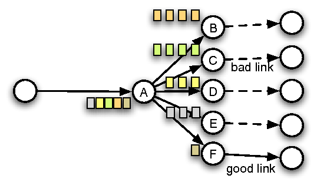
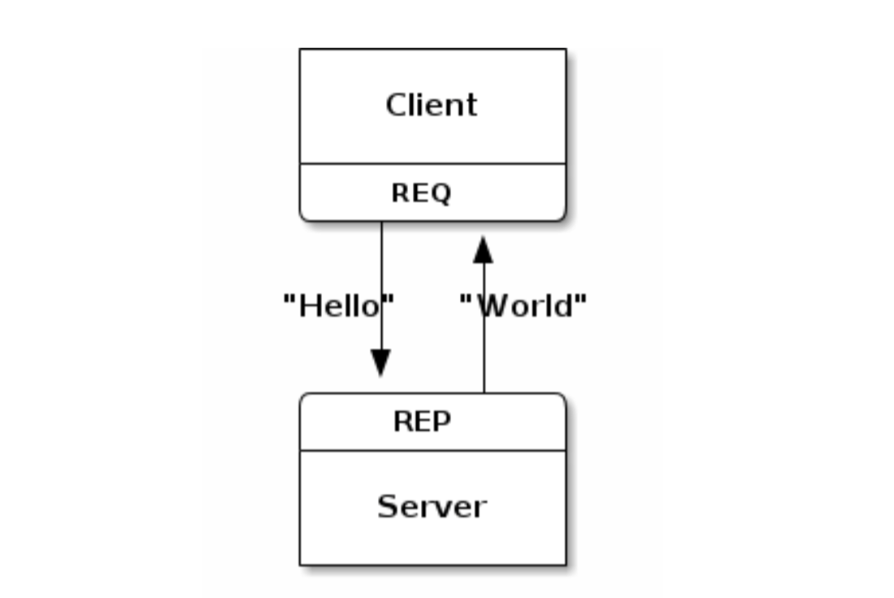
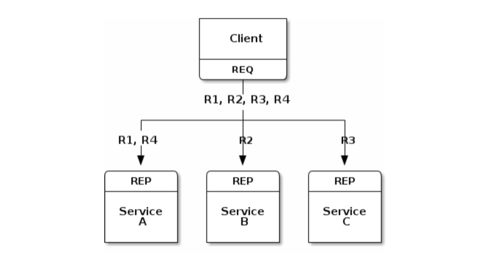
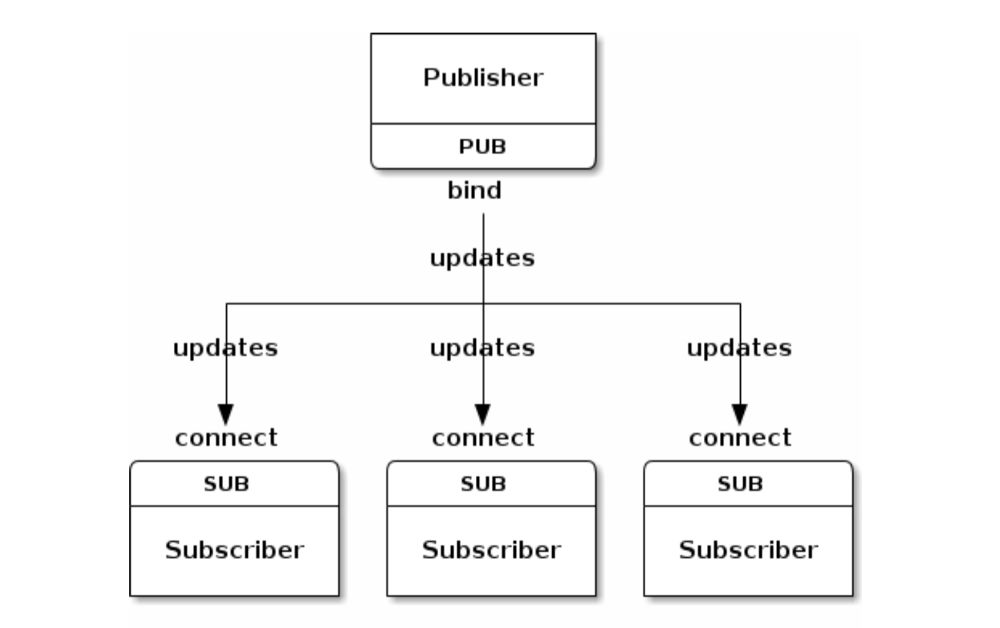
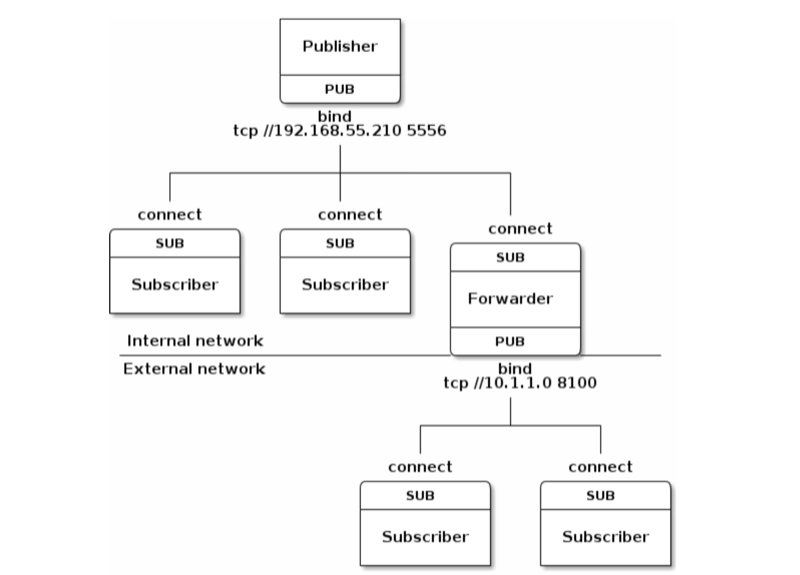
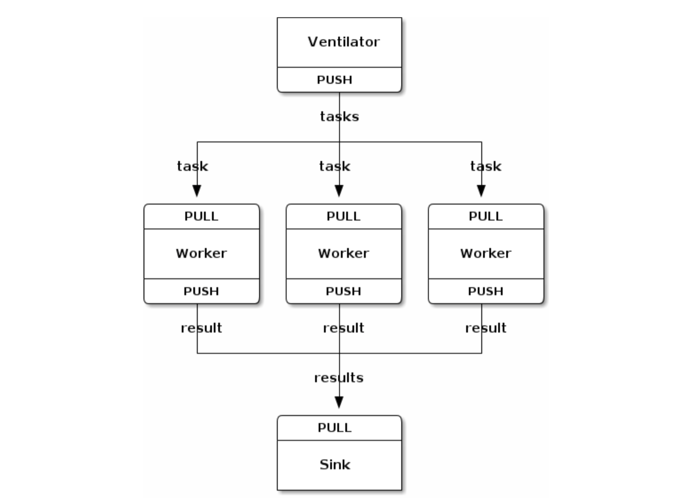
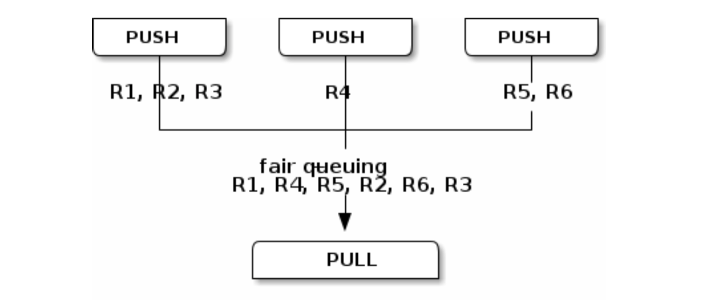
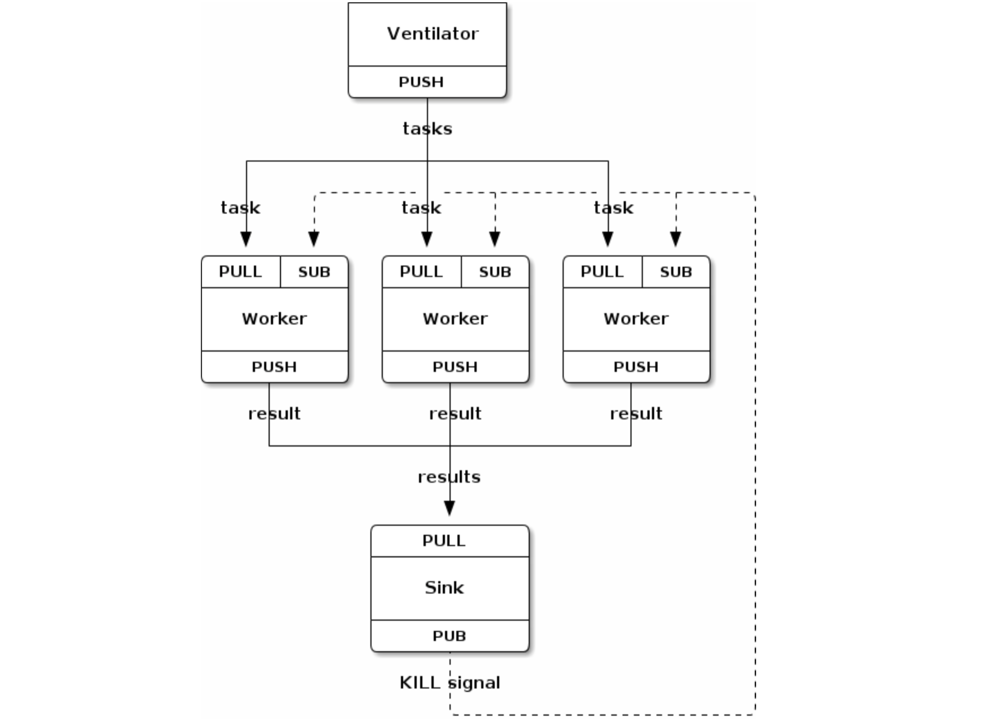
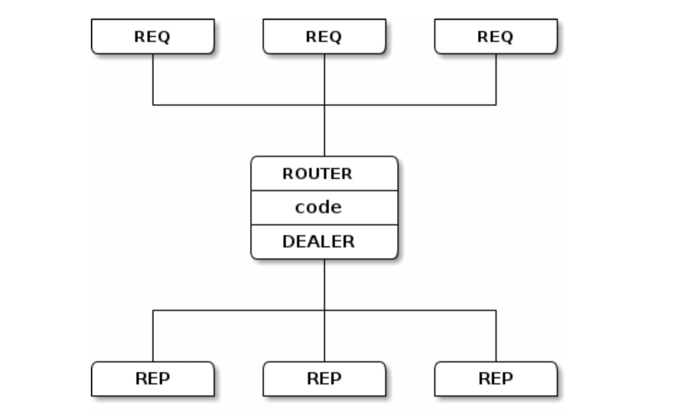
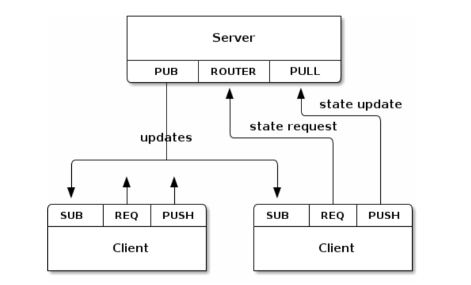

% ZeroMQ and its patterns
% Tyr Chen
% Oct 13th, 2016

# Why this talk?


> And everyone needs to learn what it means to die. It is a core part of being a full human, the embrace of one's mortality. We fight to live, of course. And when it's over, we embrace the end. I'm happy that I can teach this lesson to my children, it is one that I never had.

[A protocol for dying](http://hintjens.com/blog:115)

----

#### do't worry - this talk is tech talk, about his major work, ZeroMQ...

# Why message queue?


Queue's everywhere

# What is message queue?

> Message queues decouple processes, so if a process that is processing messages from the queue fails, messages can still be added to the queue to be processed when the system recovers

# MQ solutions

* RabbitMQ
* ActiveMQ/Apollo
* Kafka (and AWS SQS)
* AWS kinesis stream
* beanstalkd / celery
* disque (by redis authr, antirez, see [doc](http://antirez.com/news/88))
* ZeroMQ / nanomsg

# Why ZeroMQ?

* Pros:
    * a broker-less lib to integrate to your app
    * easy to use API (mostly, socket-like)
    * very efficient ([PULL/PUSH ~2M/s](https://github.com/zeromq/jeromq/wiki/Performance))
    * good scalability (10k subscribers for PUB/SUB)
    * very rich language bindings
* Cons:
    * global zmq_ctx
    * [problematic Concurrency model](http://zeromq.org/whitepapers:architecture)

# a little bit code

```javascript
// producer.js
const zmq = require('zmq');
const sock = zmq.socket('push');

sock.bindSync('tcp://127.0.0.1:3000');
console.log('Producer bound to port 3000');

setInterval(function(){
  console.log('sending work');
  sock.send('some work');
}, 500);

// worker.js
const zmq = require('zmq');
const sock = zmq.socket('pull');

sock.connect('tcp://127.0.0.1:3000');
console.log('Worker connected to port 3000');

sock.on('message', function(msg){
  console.log('work: %s', msg.toString());
});
```

# Some concepts before we dive in...

# Message delivery mode

* at-least-once
    * which implies your worker should be __idempotent__
* at-most-once
    * why this matters?
* exactly-once???

# back pressure



# now back to ZMQ & its patterns

# REQ/RES



# REQ/RES (load balancer)



# PUB/SUB



# PUB/SUB (forwarded proxy)



# PUSH/PULL (map/reduce)



# PUSH/PULL (fair queue)



# PUSH/PULL (pipeline)



# Router/Dealer



# Mixed



# Q & A
