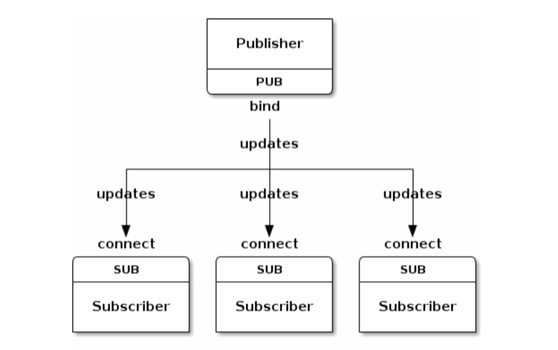
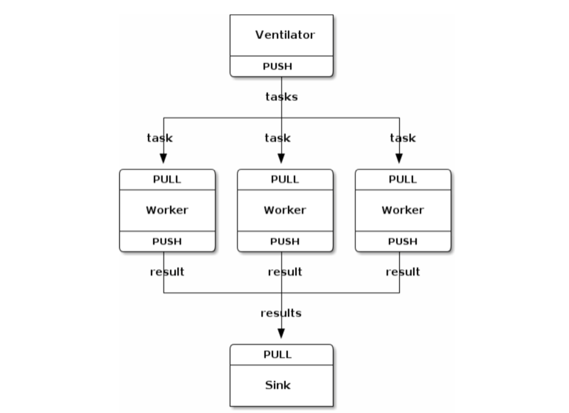
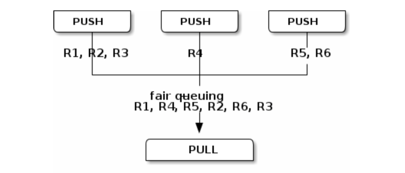
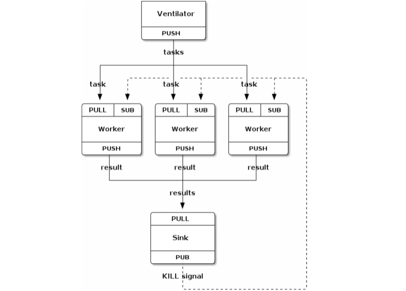

% ZeroMQ and its patterns
% Tyr Chen
% Oct 13th, 2016

# Why this talk?


[A protocol for dying](http://hintjens.com/blog:115)

> And everyone needs to learn what it means to die. It is a core part of being a full human, the embrace of one's mortality. We fight to live, of course. And when it's over, we embrace the end...


----

#### do't worry - this talk is tech talk, about his major work, ZeroMQ...

# Why message queue?


Queue's everywhere

# What is message queue?

> Message queues decouple processes, so if a process that is processing messages from the queue fails, messages can still be added to the queue to be processed when the system recovers

# MQ solutions

* RabbitMQ
* ActiveMQ/Apollo
* Kafka (and AWS SQS)
* AWS kinesis stream
* beanstalkd / celery
* disque (by redis authr, antirez, see [doc](http://antirez.com/news/88))
* ZeroMQ / nanomsg

# What is ZeroMQ?

> ZeroMQ (also known as ØMQ, 0MQ, or zmq) looks like an embeddable networking library but acts like a concurrency framework. It gives you sockets that carry atomic messages across various transports like in-process, inter-process, TCP, and multicast. You can connect sockets N-to-N with patterns like fan-out, pub-sub, task distribution, and request-reply. It's fast enough to be the fabric for clustered products. Its asynchronous I/O model gives you scalable multicore applications, built as asynchronous message-processing tasks. It has a score of language APIs and runs on most operating systems. ZeroMQ is from iMatix and is LGPLv3 open source.

from: http://zguide.zeromq.org/page:all

# Why ZeroMQ?

* Pros:
    * a message lib (not a product!) to integrate to your app
    * easy to use API (mostly, socket-like)
    * very efficient ([PULL/PUSH ~2M/s](https://github.com/zeromq/jeromq/wiki/Performance))
        * to compare, kafka is ~100k/s, RabbitMQ is ~20k/s
    * good scalability (10k subscribers for PUB/SUB)
        * if you want more, seek [nanomsg](http://nanomsg.org/)
    * very rich language bindings
        * e.g. [zmq node](https://github.com/JustinTulloss/zeromq.node), [pyzmq](https://github.com/zeromq/pyzmq)
* Cons:
    * global zmq_ctx
    * [problematic Concurrency model](http://zeromq.org/whitepapers:architecture)

# a little bit code

```javascript
// producer.js
const zmq = require('zmq');
const sock = zmq.socket('push');

sock.bindSync('tcp://127.0.0.1:3000');
console.log('Producer bound to port 3000');

setInterval(function(){
  console.log('sending work');
  sock.send('some work');
}, 500);

// worker.js
const zmq = require('zmq');
const sock = zmq.socket('pull');

sock.connect('tcp://127.0.0.1:3000');
console.log('Worker connected to port 3000');

sock.on('message', function(msg){
  console.log('work: %s', msg.toString());
});
```

# Some concepts before we dive in...

# Message delivery mode

* at-least-once
    * which implies your worker should be __idempotent__
* at-most-once
    * why this matters?
* exactly-once???

# back pressure


# now back to ZMQ & its patterns

# REQ/REP


# PUB/SUB



# PUB/SUB (forwarded proxy)


# PUSH/PULL (map/reduce)



# PUSH/PULL (fair queue)



# PUSH/PULL (pipeline)



# Router/Dealer


# Mixed


# DEMO

# References

* [Intro to ZMQ](http://www.slideshare.net/pieterh/overview-of-zeromq)
* [ZMQ guide](http://zguide.zeromq.org/page:all)
* [ZeroMQ is the answer, video](https://www.youtube.com/watch?v=v6AGUeZOVSU)
* [ZeroMQ is the answer, slides](http://www.slideshare.net/IanBarber/zeromq-is-the-answer)
* [You cannot have exactly-once delivery](http://bravenewgeek.com/you-cannot-have-exactly-once-delivery/)
* [adventure in message queues](http://antirez.com/news/88)

# Q & A
